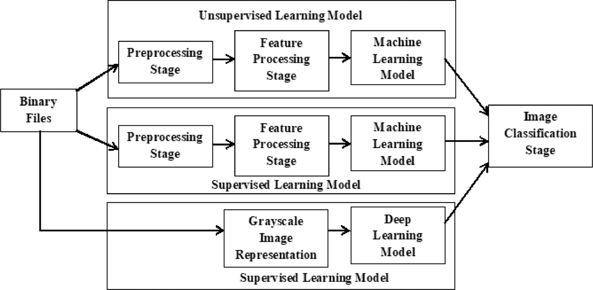

# A hybrid deep learning image-based analysis for effective malware detection

互联网的爆炸性增长和最近使用智能应用程序的自动化趋势为恶意软件（malware）攻击者提供了名副其实的游乐场。随着各种设备通过互联网无缝连接并收集大量数据，不断升级的恶意软件攻击和安全风险成为一个大问题。尽管有多种恶意软件检测方法可用，但需要新方法来匹配此类数据密集型环境的规模和复杂性。我们提出了一种新颖且统一的混合深度学习和可视化方法，用于有效检测恶意软件。本文的目的有两个：1. 介绍使用基于图像的技术来检测系统的可疑行为，以及 2. 提出和研究基于混合图像的方法与深度学习架构的应用，以实现有效的恶意软件分类。通过采用恶意软件行为模式的各种相似性度量以及对成本敏感的深度学习架构来衡量性能。通过使用公共和私人收集的大型恶意软件数据集测试我们提出的混合方法来对可扩展性进行基准测试，这些数据集显示了我们的恶意软件分类器的高精度。

## 1. Introduction

随着我们进入由互联网技术和智能自动化的进步推动的第四次工业革命（工业 4.0），我们越来越多地面临安全漏洞。开发防御系统来抵御恶意软件 (malware) 攻击很重要，这些攻击可以通过在不获取任何用户许可和身份验证的情况下渗透他们的计算系统、数据和应用程序来破坏业务 [1,2]。 “恶意软件”一词涵盖范围广泛的恶意代码，例如计算机病毒、蠕虫和可能导致拒绝服务攻击的潜在有害程序 (PUP)。今天，一些恶意攻击是由现有恶意软件的未知变体引起的，这些变体混淆了它们的行为以逃避检测 [3]。随着种类繁多的开源软件和通过互联网无缝安装应用程序的兴起，有效检测这种大规模隐蔽生成的新型混淆恶意软件是一项重大挑战。因此，为了对抗这种恶意软件战争，网络安全领域的恶意软件检测解决方案正在不断发展，本文在这个研究方向上迈出了适度的一步。

几十年来，防病毒软件解决方案构成了最常用的用于检测和缓解恶意软件的商业系统。传统上，此类解决方案基于病毒签名，当遇到新的恶意软件时，需要人工干预来监督和更新签名数据库。最近，正在开发的机器学习系统能够减轻基于签名的系统的局限性 [4-6]。这种自学习系统能够采用数据挖掘和深度学习方法，可以促进复杂病毒模式的学习，以区分良性和恶意软件二进制文件。然而，不同的自学习方法在检测现有恶意软件甚至全新恶意软件的变体的能力方面表现出一定程度的可变性。正在进行多项研究，以探索不同的自学习技术方法对恶意软件检测的适用性，并将此类模型的可扩展性和性能与各种数据集进行比较 [7,8]。首先了解黑客采用的基本方法以及恶意软件混淆技术是很重要的，以便提出创新的解决方案模型来匹配这个网络安全问题。

最常用的恶意软件检测方法有两种主要技术：静态和动态分析[4-8]。 静态分析通过反汇编程序二进制文件来使用文件的语法和结构特性，以提取特征。 动态分析则需要在文件运行期间对其进行动态分析，以提取程序执行的特征动作。 以前的研究也结合了静态和动态方法 [9,10]。 当今的许多商业系统已经开始使用静态和动态分析的混合进行恶意软件检测。 然而，需要新的方法来改进检测黑客越来越多地发起的恶意软件的不同混淆的技术，最近的研究比较了静态、动态和混合方法，在当前范式中产生了各种影响 [4]。

恶意软件编写者采用多种混淆技术，使用变形和多态方法来生成现有恶意软件家族的变体，以逃避检测，这已成为一种常见做法 [3,4]。 此外，可以使用打包方法混淆整个程序二进制文件，以确保代码只能在运行时进行分析 [11]。 这种非标准和定制包装的逆向工程是劳动密集型的，需要在虚拟环境中执行二进制文件以进行解包 [12]。 因此，正在开发能够结合人类专家的自学特征的智能方法，例如机器学习。

已经研究了用于恶意软件的静态、动态和混合分析的机器学习模型，显示了检测混淆恶意软件的有希望的结果，并且已经研究了它们的影响，推动了在这个方向上的进一步研究 [4,13-16]。许多静态恶意软件检测方法通过探索支持向量机 (SVM)、隐马尔可夫模型 (HMM) k-最近邻 (KNN) 和朴素贝叶斯 (NB) [17,18] 等不同分类器来区分其工作。通常，对于基于动态分析的技术，通过执行恶意软件来分析恶意软件行为模式的各种痕迹。在文献中，两种常用的动态分析方法是**控制流分析**和 **API 调用分析** [3,6,13]。总的来说，之前的研究已经探索了几种基于特征的方法，包括高级 API 调用以及用于基于 n-gram 的恶意软件检测的低级操作码 [18-20]。半自动数据分析方法要求恶意软件分析师分析和解释中间结果，这可能很耗时，因此提出了自学习和智能框架 [21,22]。在这项工作中，我们采用了机器学习和相似性挖掘方法，这些方法已有效地应用于静态和动态恶意软件检测，并以基于图像的深度学习方法为重点。

基于图像的技术可以在检测可疑的未知恶意软件时提供复杂的视觉辅助，以便快速警告异常行为模式。恶意软件模式的可视化表示具有提供可能攻击的汇总图的优势。视觉分析以及人类专家的分析推理可以加快恶意软件检测过程 [23,24]。相似性挖掘是一种基于距离度量相似性分析的机器学习方法。在可视化分析中，最近采用相似性挖掘来检测恶意软件。通过使用基于图像的分析进行恶意软件检测，这项工作比之前的研究更进一步。在本文中，我们提出了一种混合模型，通过采用相似性挖掘和深度学习架构来准确检测混淆的恶意软件并将其分类到其恶意软件家族中。不同恶意软件家族的图像比较以及良性数据集用于直观地展示恶意软件家族行为模式的显着差异。此外，采用深度学习技术来促进自学习，从而在我们提出的分类器中实现高精度。

总的来说，我们提出的模型的主要贡献是：

1. 通过采用具有计算成本效益和可扩展性的基于图像的机器学习技术，开发用于恶意软件检测和分类的混合深度学习模型。
2. 通过对不同公共和私有数据集的各种经典机器学习和深度学习技术进行深入分析来进行实验研究，目的是评估我们提出的架构在处理新恶意软件系列的大型数据集方面的有效性。

我们将论文的整体结构组织如下。 第 2 节提供了计算机安全领域基于图像的分析的相关工作。 本研究采用的拟议混合模型在第 3 节中介绍。第 4 节描述了用于研究的实验设置和数据集。 第 5 节介绍了我们提出的模型的性能评估结果，表明使用机器学习和深度学习架构实现了高分类精度。最后，我们提供了我们的结论，在第 6 节中强调了研究和未来研究工作的局限性。

## 2. Related work

许多使用模式相似性的基于图像的分析分为两大类：（1）面向投影或（2）面向语义[25]。在计算机安全领域，可视化工具经过了一段时间的发展，对于处理大文件的海量数据变得越来越有用。相似性矩阵的二维可视化是一种传统技术，用于捕获对象之间的相关相似性度量 [26,27]。它提供了三个关键特性：（i）一旦形成相似空间，数据的高维部分不影响进一步处理； (ii) 形成具有同等重要性的集群，并且 (iii) 彼此相关的集群显示为彼此相邻，有助于结果的可视化 [25]。将文档直观地表示为 2D 或 3D 平面上的点是一种常见的做法。每对点之间的距离表示两个文档的相似程度，即它们越接近，两个文档内容越相似[28,29]。

最近，研究采用了基于图像的网络安全攻击分析 [30]。一些半自动化技术涉及对安全外壳 (SSH) 蛮力尝试的视觉调查，这些尝试通过不同颜色识别出的各种异常以及用户 ID 和互联网协议 (IP) 地址的详细信息 [31]。可视化技术也被用来一次显示大数据包的概览。这些图像显示了网络数据包之间的关系，这有助于安全分析师放大到更多细节 [32]。另一项研究使用基于图像的分析来解释恶意软件攻击的时间顺序，例如鱼叉式网络钓鱼攻击，并用颜色指示成功连接到系统的类型 [33]。图 1 显示了这些连接的“什么”、“哪里”和“何时”的信息，以及如何使用它们的 IP 地址来估计到其他主机的距离 [34,35]。各种类型的警报在连续的时间间隔内显示为同心环的单独扇区，对同一主机的不同可能攻击用颜色编码的连接来描述。这些视觉技术大多采用基于文本的网络参数和日志分析来获得不同颜色的图像表示，用于半自动分析和检测恶意软件攻击。此类研究非常受限制，重点是网络流量和渗透分析 [36,37]。此外，这些在当今的大数据世界中非常耗时，并且正在探索基于图像纹理表示及其分析的各种方法 [38]。

图1 网络连接类型（什么）、被攻击的资源（哪里）和时间（何时）的可视化。

可执行二进制文件的不同部分表示为独特的图像纹理，以便进行更快的分析，从而提高恶意软件分析师的工作效率。 这种基于纹理的图像分析的优势在于，它们可以提供有关恶意软件结构的更多信息，显示即使是很小的代码更改，同时保留了代码的整体结构。 图 2(a) 显示了显示独特纹理的二进制代码的不同部分，这有助于识别相似的模式 [38]。 例如，图 2(b) 显示了属于同一恶意软件家族的四种恶意软件变体的图像相似性，称为 Dialplatform.B。

图2 显示二进制部分相似性的恶意软件家族变体的图像

基于纹理的恶意软件图像分析的主要限制是某些恶意软件混淆无法轻松分析。 恶意软件可以使用不同的打包方法和不同的分辨率进行打包。 因此，需要一种改进的解决方案来使用基于图像的分析对恶意软件进行分类 [39]。 最近，为了对混淆的恶意软件进行分类，已经分析了称为要点描述符的图像特征，并且将这些技术与深度学习技术进行了比较，以评估其鲁棒性 [40]。 研究人员正在探索几种此类创新技术，以解决混淆恶意软件检测的主要挑战。 

在本文中，我们提出了各种有监督和无监督技术的混合模型来执行图像分析，以有效地检测和分类未知恶意软件。 通过使用各种大型公共和私有数据集，我们进行了实验研究，以证明如何在所提出的分类器中有效地采用相似性挖掘与深度学习架构相结合。 我们提出的模型将在下一节中描述。

## 3. Proposed Hybrid Model

深度学习是一种机器学习，已在不同领域的各种应用中使用。这主要是因为这些方法能够通过获取原始输入样本隐式地学习最佳特征表示。最近，深度学习架构的应用被用于恶意软件检测。在基于图像的深度学习方法中，恶意软件二进制文件被转换为灰度图像表示，并采用深度学习架构来学习复杂的特征（图像模式）[40-45]。最常用的深度学习架构是卷积神经网络 (CNN) 和长短期记忆 (LSTM)。这两种方法的根本区别在于CNN能够提取空间特征，而LSTM能够学习序列信息。 CNN 和 LSTM 都可以结合起来有效地学习空间和序列信息。最近的一项研究使用 TensorFlow 进行依赖于迁移学习的深度学习实验，并且能够获得超过 98% 的测试准确率 [40]。在另一项工作中，提出了一种基于 CNN 的恶意软件分类方法来处理类不平衡问题，与基于经典机器学习算法的现有众所周知的方法相比，取得了良好的结果 [41]。另一项工作提出了一种将字节文件转换为图像表示的新方法，并采用了深度学习架构进行分类 [42]。

为了避免类不平衡问题，他们的实验采用了随机抽样和类再平衡抽样方法。 类重新平衡方法比现有的基于经典机器学习的方法表现更好，具有最高的 F1-score。 一些研究人员提出了一种恶意软件分类框架，通过使用 SimHash 将反汇编的恶意软件代码转换为灰度图像，并使用 CNN 进行分类 [43,44]。 另一项工作提出了基于 RNN 和 CNN [45] 组合执行恶意软件分类的操作码静态分析。 最近的一项研究采用了成本敏感的 LSTM 来处理类不平衡和多类分类问题，结果显示出比成本不敏感的 LSTM 更好的性能 [46]。

本文比之前的工作更进一步，提出了一种基于混合深度学习的入侵检测框架 [47]。 在之前的工作中，通过使用各种公开可用的数据集进行多次实验，开发了最佳机器学习模型。 结果表明，该方法可以很好地扩展以处理大量网络事件，同时使用图像分析和深度学习方法在实时环境中有效地检测和分类攻击。 这项工作采用了类似的方法，但在使用基于图像的深度学习分析将恶意软件变体分类到其恶意软件家族的重点上有明显不同。 提出的混合架构使用监督和无监督学习模型的组合进行基于图像的恶意软件分类，如图 3 所示。

图3 提出的混合架构

本文所提出的架构使用自学习系统，该系统不仅能够检测已知恶意软件和已知恶意软件的变体，还能够检测未知恶意软件。更重要的是，自学习系统使用经典机器学习和当代深度学习模型来捕捉二进制文件的复杂特征，这些特征可以最好地用于区分良性和恶意二进制文件。该架构由三个不同的子系统组成，其中一个子系统基于无监督学习模型，另外两个子系统基于监督学习模型。图 3 中所示的每个预处理阶段用于将二进制文件转换为不同的特征表示，以便采用机器学习和深度学习模型。为了增强对混淆恶意软件的恶意软件检测，可以在实时系统中使用这种类型的混合系统。所有这些子系统都使用经典和高级机器学习模型和基于图像的分析来有效地学习恶意软件二进制文件的复杂系统行为。

本文提出的的恶意软件分类深度学习架构使用 CNN 和双向管道。 包括误算成本，一般而言，包含较多恶意软件样本的恶意软件家族计算成本较低，而包含较少样本的恶意软件家族计算成本较高。 一开始，成本矩阵是未知的，并采用遗传算法来找出最优成本矩阵。 然而，这种方法耗时且计算成本高。 因此，为了为每个样本选择一个最优值，让我们假设至少一个类别样本具有相同的成本。 让$c[i,i]$表示类 $i $的误分类成本，它是使用下式中定义的类分布生成的：
$$
c[i,i]=(\frac{1}{n_i})(\frac{1}{n_i})^\gamma
$$
其中$\gamma \in [0,1]$是一个权衡参数。 当$\gamma = 1$时，$c[i, i]$ 与类大小 $n_i$成反比，当$\gamma = 0$ 时，成本敏感的 LSTM 减少为原始 LSTM，成本不敏感。 为了找到$\gamma$的最佳值，我们对本文提出的的架构运行了 3 次，其值在 0 到 1 的范围内，最终得出当$\gamma = 0.2$时表现良好。

卷积神经网络（CNN）是经典神经网络的改进模型，在计算机视觉领域的各种长期人工智能任务中表现良好[39]。首先，CNN 由三个不同的层组成，卷积层、池化层和全连接层。卷积层包含一个卷积操作，该操作使用过滤器在图像上滑动以捕获特征。通过使用修正线性单元 (ReLU)，这些特征被映射到称为特征映射的非线性空间中。由于特征图的维度可能非常大，我们使用池化来降低维度。最常用的池化操作是 max、min 和 average 函数，我们使用 max-pooling。池化特征被传递到双向门控循环单元（GRU），它学习字节序列的顺序信息，最后，特征被传递到全连接层。我们使用非线性激活函数进行分类，最常用的函数是用于二元分类的 sigmoid 和用于多类分类的 Softmax。为了减少训练过程中的损失，我们使用了分类交叉熵：
$$
loss(p,e)=\sum_ip(x)log(e(x))
$$

