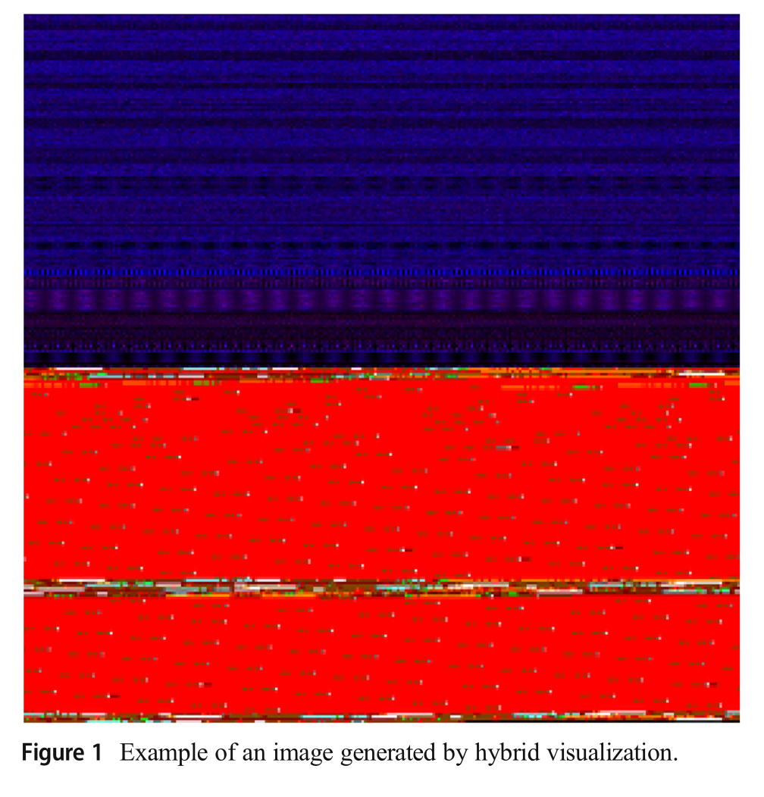

# A Method for Windows Malware Detection Based on Deep Learning

随着互联网的飞速发展，恶意软件的种类和数量不断多样化和增加，规避安全软件的技术也越来越先进。 本文提出了一种基于深度学习的恶意软件检测方法，将恶意软件可视化技术与卷积神经网络相结合。 神经网络的结构基于VGG16网络。 本文提出了恶意软件的混合可视化，结合静态和动态分析。 在混合可视化中，我们使用 Cuckoo Sandbox 对样本进行动态分析，根据设计的算法将动态分析结果转换为可视化图像，并在静态和混合可视化图像上训练神经网络。 最后，我们测试了我们提出的恶意软件检测方法的性能，评估其检测未知恶意软件的有效性。

## 1. Introduction

近年来，互联网持续快速发展，在广大民众的工作和生活中发挥着越来越重要的作用。与此同时，互联网上的恶意软件（malware）也在激增，对互联网用户的信息安全构成极大威胁。最早（并且仍然被广泛使用）的恶意软件检测技术是基于“签名”的，它只是恶意软件二进制文件中唯一标识它的代码序列 [1]。为了检测恶意软件，将签名添加到防病毒程序中，然后将签名与正在扫描的文件进行匹配。如果在某个文件中找到匹配项，则确定该文件是恶意的。基于签名的检测具有不易产生误报的优点，因为签名是由专业的恶意软件分析人员手动导出的。但是，它有一个主要缺点：它只能检测已知的恶意软件 [2]。当出现新的恶意软件时，提取签名并将其添加到防病毒程序需要时间，从而使用户在一段时间内不受保护。为了解决这个问题，研究人员提出了启发式检测[3]。启发式检测旨在通过发现程序中的可疑特征来检测未知恶意软件。例如，如果一个程序受到一些很少见的“加壳程序”的保护，那么它就被确定为可疑的。这种技术可以识别一些新的恶意软件，但会增加误报率。

鉴于基于签名和启发式检测的不足，研究人员和网络安全公司将注意力转向机器学习，希望找到一种及时准确检测恶意软件的新方法。

研究人员已尝试在恶意软件检测中使用机器学习。 Zhang [4] 使用朴素贝叶斯来检测恶意软件。 Lu [5] 和 Ravi 等人。 [6] 从 PE 文件中提取操作码序列，并使用 n-gram 与 KNN、SVM 和决策树一起对恶意软件进行分类。 Zhang 和 Yang [7] 提取 Android 应用程序中的代表性权限，为权限分配不同的权重，并使用朴素贝叶斯对恶意软件进行分类。 杨等人[8]提取PE文件的图标并通过计算图标上的图像相似度来检测恶意软件。

最近，深度学习势头强劲。研究人员已尝试将其应用于计算机科学的各个子领域，例如数据隐私和保护 [9, 10]、漏洞检测 [11]、数据压缩 [12]，最重要的是恶意软件检测。由于目前使用 CNN 的图像分类已有了深入研究，因此很自然地尝试将恶意软件检测问题转化为图像分类问题。为此，有人提出了恶意软件可视化的想法。目前，已经对恶意软件可视化进行了一些探索。纳塔拉吉等人 [13] 提出了一种方法，将恶意软件二进制文件转换为灰度图像，使用 GIST 提取纹理特征，最后使用 KNN 对恶意软件进行分类。卡拉什等人 [14] 也将恶意软件二进制文件转换为灰度图像，但他们使用 CNN 对恶意软件进行分类。 Li [15] 将 Android .dex 文件可视化为像素归一化的 RGB 图像，这些图像的色调主要为蓝色，然后使用 CNN 和 KNN 实现检测。傅等人[17] 根据熵、字节值和相对大小将 PE 文件转换为 RGB 图像，从图像中提取特征，然后使用机器学习算法对恶意软件进行分类。除了上述使用静态特征的可视化技术外，Shaid 和 Maarof [18] 提出了一种基于动态特征（即运行时行为）对二进制文件进行可视化的方法；他们为更危险的 API 调用分配更明显的颜色。

本文在该领域前人工作的基础上，提出了一种基于可视化和深度学习的恶意软件检测方法。 它与现有方法不同，因为：

1. 它在检测中结合了静态和动态特征，使其在面对分析规避技术时更加稳健； 通过实验，我们可以得出结论，这种混合方法比单独使用静态特征表现更好。
2. 它探索了一种新的静态可视化算法，该算法利用字节频率信息，而不是常用的 PE 部分的熵。
3. 它将恶意软件可视化为 RGB 彩色图像，利用所有三个颜色通道（而不是灰度图像中只有一个通道）从原始文件中获取更多信息。

本文描述了一种基于深度学习的恶意软件检测方法，并通过实验评估其性能。

## 2. Malware Visualization

### 2.1 Overview

根据分析大量恶意软件获得的经验知识，研究人员发现同一家族的变种之间存在相似性。 例如，[13] 表明属于同一家族的恶意软件二进制文件在视觉上是相似的。 这是真的，因为代码经常在变体之间重用 [19]。 另一方面，彼此不相关的二进制文件通常在其可视化图像上差异很大，这使得深度学习算法可以发现恶意软件和合法软件（干净软件）之间的差异。

为了能够在恶意软件检测中使用神经网络，我们首先必须将输入转换为向量形式，即对其进行向量化。 主要有两类矢量化方法：（1）基于特征的方法，和（2）基于图像的方法。 本文采用基于图像的方法，也称为恶意软件可视化。

### 2.2 Static Visualization

在静态可视化中，我们根据静态特征将恶意软件可视化为 RGB 彩色图像。 RGB 图像中的每个像素都有三个通道：红色、绿色和蓝色。 与灰度图像相比，RGB 图像可以容纳（在相同图像大小下）来自原始文件的更多信息，从而有助于恶意软件检测。

我们使用 [13] 中使用的灰度值作为 RGB 图像中蓝色通道的值，然后将字节频率信息编码到红色通道中。 字节频率与信息熵直接相关，如下面的熵定义所示：
$$
H(X)=-\sum_{i=1}^{N}p(i)log_2p(i) \tag{1}
$$
在等式中 (1)、$p(i)$表示事件$X$的$N$个符号序列中第$i$个符号（字节值）的概率。 高熵值往往表明存在加密或加壳器 [20]。 在[17]中，恶意软件基于信息熵进行可视化，但其方法是计算PE部分的熵。 我们的方法使用字节频率信息，这适用于 PE 和非 PE 可执行文件。 图像的绿色通道暂时未使用，并用零填充。

为了静态地可视化一段恶意软件，首先读入它的二进制文件，并将其拆分为一个由 8 位无符号二进制整数组成的向量。然后，将向量中的 8 位无符号整数转换为十进制值。此步骤的输出称为十进制向量。接下来，根据十进制向量中数字的出现次数（字节频率）构造一个计数向量。例如，一个计数向量$\alpha =<24, 32,… >$ 表示在十进制向量中，0出现了24次，1出现了32次，等等。 现在我们准备构造一个像素向量，其中每个分量是一个 3 元组，表示一个 RGB 像素。第$ i $个分量的蓝色通道值等于十进制向量中第$ i $个分量的值。第$ i $个分量的红色通道值与计数向量有关，如式(2)-(5)。绿色通道未使用，所有组件都设置为零。构建好像素向量后，将其整形为宽度为512的像素矩阵，并保存为图像。最后，将图像缩放到 512 × 512 像素，以便输入神经网络。
$$
atanNorm(\bold{x}) = \arctan(\bold{x}) \times \frac{2}{\pi} + 1 \tag{2}\\
$$

$$
minMaxNorm(\bold{x}) = \frac{\bold{x}-\min(\bold{x})}{\max(\bold{x})-\min(\bold{x})} \tag{3} \\
$$

$$
\beta=\lfloor minMaxNorm(atanNorm(\bold{\alpha})) \times(-255) + 255 \rfloor \tag{4} \\
$$

$$
R(i) = \beta_i \tag{5}
$$

在上面的等式中，如果输入涉及向量，则反正切函数、算术运算和向下取整函数都是按分量应用的。 向量$\alpha$是已经描述过的计数向量。 $R(i)$表示像素向量第$i$个分量的红色通道值。$\beta_i$表示向量$\beta$的第$i$个分量。

我们现在解释我们开发的方程的含义。为了导出红色通道值，我们需要将计数向量缩放到范围 [0,255]。为此，首先将函数 $atanNorm$ 和 $minMaxNorm $应用于计数向量以将其分量归一化到范围 [0,1]。应用 $atanNorm $的一个原因是，在典型的合法二进制文件中，并非所有字节值都以相似的频率出现。事实上，某些值（例如，字节 0）可能比其他值出现得更频繁。 $arctan$函数随着输入的增加增长越来越慢，所以应用它是希望减少可能的异常值的影响。如果我们将区间 [0,1] 中的值乘以 255，我们将获得区间 [0,255] 中的值，该值已经适合用作像素的通道值。但是，我们希望在图像中用更亮的红色突出显示恶意软件二进制文件中更多信息的区域。回顾信息论中的知识，人们知道事件发生的可能性越小，它携带的信息就越多。因此，在乘以 255 后，我们进一步将值乘以−1，然后将其加上 255，这样出现频率较低的字节值会获得更高的红色通道值。最后，因为像素值需要是一个整数，所以采用了向下取整函数。

### 2.3 Hybrid Visualization

混合可视化结合了静态和动态方法。 在动态可视化中，程序的行为被可视化为图像。 在现代操作系统上，当程序希望从操作系统请求服务时，例如访问硬盘，它必须发起系统调用。 因此，通过监视程序发出的系统调用，我们可以了解它的重要行为。

在 Windows 上，系统调用称为 Windows API。 许多沙盒解决方案可以监控所选程序的 API 调用。 在本文中，我们使用 Cuckoo Sandbox，它将 API 分为 17 类。 为了可视化程序行为，我们为每个类别的 API 分配一种颜色，将程序的 API 调用序列转换为 API 类别序列，然后从中导出图像。 我们在设计API类别到颜色的映射表时，遵循了这样一个原则：潜在危险的API类别分配暖色，相对无害的API类别分配冷色。 我们最终设计的映射表如下（表1）。

表1 API类别颜色映射表

现在我们叙述本文中使用的动态可视化算法。 首先在沙箱中运行指定的程序，获取其API调用顺序。 然后将序列中的每个 API 调用转换为其相应的类别。 结果称为 API 类别向量。 接下来，将 API 类别向量中的每个 API 类别映射到其对应的 RGB 值，所得向量称为像素向量。 得到像素向量后，将其整形为宽度为512的像素矩阵，并保存为图像。 最后，将图像缩放到 512 × 512 像素。

通过混合可视化，我们将静态和动态图像合并到一张图像中。通过这样做，我们将原始文件的静态和动态特征编码为单个图像。静态特征反映了原始二进制文件的结构和布局，它们在恶意软件变体之间是相似的，因此有助于识别恶意软件。然而，静态分析很容易因使用混淆和代码转换（如加壳程序）而受挫。与静态分析相比，动态分析对这些的影响要小得多[21]。混淆或代码转换旨在生成在语义上保持等效的结构更复杂的程序。这意味着所生成的程序的行为不应有太大变化（如果有的话）。通过使用动态（行为）分析，我们能够比静态分析更有效地处理混淆或转换的代码。然而，动态方法并非没有缺点，目前已有了用于规避基于行为的分析的技术。例如，恶意软件可以检测它是否正在受监控的环境中运行；如果是这样，它将改变其行为 [22]。静态方法不受这些规避技术的影响。因此，我们结合静态和动态的混合方法克服了两种方法的局限性。当它处理仅试图逃避这两种分析中的一种的恶意软件时，它会更加健壮。

要使用混合方法可视化恶意软件，首先必须对原始二进制文件执行静态和动态可视化。 如果动态可视化失败（例如，因为二进制文件无法在沙箱中运行），混合方法就会失败。 否则，继续将动态图像放置在静态图像下方，形成大小为 512 × 1024 像素的新图像。 最后，将新图像缩放到 512 × 512 像素以获得混合图像。图 1 演示了由上述混合方法算法生成的图像。

混合图像中编码了丰富的信息。图 1 清楚地分为上（静态）半部和下（动态）半部。在上部，有一个明显的纹理：蓝色和黑色区域的交替带。蓝色区域对应不同的 PE 部分，黑色区域是它们之间的间隙（空字节）。在上部的底部，我们看到彼此相邻的紫色块。这些实际上是嵌入在可执行文件中的资源（字符串、图标等），它们以更红的色调进行可视化。这将区域分开，因为它具有与其他区域不同的字节频率。上半部分的纹理和颜色反映了二进制文件的结构和布局，通常是某个恶意软件变体（如果是恶意软件）的特征。在下半部分，我们看到大的红色区域，表明存在许多潜在危险的系统调用。特别是，这些调用是与进程相关的操作，例如进程创建或远程代码注入。将恶意代码注入其他进程是典型的恶意软件行为。一个合法的程序可能会执行与进程相关的操作，但通常不会以如此庞大的数量或如此频繁地进行。因此，下半部分向我们表明所讨论的二进制文件非常可疑。通常，混合图像的下半部分表示二进制行为的“风险”。图像中编码的静态和动态信息为深度神经网络提供了区分恶意软件和干净软件的基础。

## 3. Experimentation

本文使用的网络架构基于VGG16网络。 网络的输入是一个可视化图像； 网络的输出是一个二维向量，第一个分量是原始文件恶意的概率，第二个分量是原始文件合法的概率。

### 3.1 Datasets

训练过程中使用了两个数据集：训练集和验证集。 这两组中的所有图像都分为两类：恶意软件和清洁软件，图像来自我们收集的样本二进制文件。 恶意软件类样本是从virussign.com于2020年3月12日提供的免费恶意软件包中收集的，包内有613个运行在32位系统上的恶意PE文件，4个运行在64位系统上 . 清洁软件类样本共1310个文件，来自Windows 7自带的系统程序和作者电脑上安装的合法软件。

可视化后，生成了 617 张恶意软件静态图像和 1310 张清洁软件静态图像。 对于某些程序，无法生成它们的混合映像，例如，因为它们无法在沙箱中运行。 因此，混合图像比静态图像少。 生成了 512 个恶意软件混合图像和 888 个清洁软件混合图像。

我们随机选择每类中 80% 的样本进行训练，其余 20% 进行验证。 数据集的最终大小如表 2 所示。

表2 数据集大小

### 3.2 Model Training

在本文中，我们训练了两个模型：基于静态可视化的模型 A 和基于混合可视化的模型 B。 两种模型都基于 VGG16 网络。 权重是随机初始化的。 网络的输入是大小为 512 × 512 × 3 的图像。在网络的末端，我们使用全局平均池化层和 Softmax 层代替三个全连接层以降低计算成本。 网络参数采用Adam算法学习，学习率为1e-4。 我们使用二元交叉熵作为损失函数。 批量大小设置为 24。我们训练模型 A 43 次，模型 B 训练 40 次。我们在训练期间保留了最高准确率的模型。

模型 A 在训练集和验证集上的损失和准确度与训练时期的关系绘制在图2和图3中。

图2 模型A数据集和验证集的Loss值

图3 模型A数据集和验证集的准确度

模型 B 在训练集和验证集上的损失和准确性与训练时期的关系绘制在图4和图5中。

图4 模型B数据集和验证集的Loss值

图5 模型B数据集和验证集的准确度

### 3.3 Evaluation

我们通过以下方式对模型进行评估：

1. 评估验证集的准确性，即模型在与训练集相似的样本上的表现如何。
2. 在准确性方面将我们的模型与其他类似方法进行比较。
3. 评估新选择的测试集的准确性，即模型在完全未知的样本上的表现如何。

表 3 展示了两种模型在验证集上实现的准确性。结果表明，模型 B 在验证集上优于模型 A。

表3 模型验证准确率

接下来，我们将我们的模型与使用机器学习或深度学习的其他方法进行比较。 结果如表4所示。

表4 不同模型间准确率的比较

模型 B 优于各种工作中使用的方法。 然而，应该注意的是，在 Li [16] 和 Xia [17] 的作品中，数据集基于 Android 恶意软件，而在本文中，我们使用的是 Windows 恶意软件。

最后，我们在新的测试集上评估模型的准确性。 测试集样本来自virussign.com于2020年3月8日至2020年3月18日提供的免费恶意软件包（与训练集和验证集不重复）。 我们从包中随机选择了 200 个文件作为我们的测试集。 评价结果如表5所示。

表5 模型的测试精度

我们可以从结果中得出结论，两个模型在测试集上的表现都比在验证集上的表现差，这是在意料之中的，因为测试集包含对模型来说全新的样本。 此外，模型 B 在测试集上的表现仍然优于模型 A，其准确性与验证集上的相比并没有下降太多。

## 4. Conclusions and Future Work

本文提出了一种基于深度学习和恶意软件可视化的恶意软件检测方法。 首先，我们根据样本文件的静态特征生成静态可视化图像。 其次，我们在我们的VM中运行样本，获得由Cuckoo Sandbox生成的行为分析报告，然后用于派生动态可视化图像。 第三，我们合并静态和动态图像，形成混合图像。 最后，我们分别在静态和混合图像上训练两个检测模型。 本文还评估了我们训练的两个模型，并得出结论，混合方法的性能优于单独的静态方法。

在实验中，我们还发现 Model B 在以下两类恶意软件上表现不佳：

1. 旧的恶意软件(例如十年前的);
2. QQ密码窃取木马

由于模型 B 没有对过去的恶意软件二进制文件进行充分的训练，因此无法检测到其中的大部分。 我们可以得出结论，模型 B 虽然能够在一定程度上预测未知恶意软件，但需要定期（但可能不频繁）更新以适应当前流行的恶意软件。 模型 B 对类型 (2) 恶意软件效果不佳的原因可能是 QQ 密码窃取木马需要特定环境（例如，安装了 QQ、即时通讯应用程序）才能在虚拟机 (VM) 中运行。 我们没有在我们的 VM 中安装 QQ，这大概可以防止木马表现出恶意行为。 模型 B 基于混合方法，部分依赖于程序行为来检测恶意软件。

考虑到Model B的上述弱点，我们未来可以在以下几个方面进行改进：

1. 提高其可扩展性，以便更轻松地更新以适应当前的恶意软件；
2. 在 VM 中安装常用的应用程序，允许恶意软件表现出完整的行为。

最后，我们希望将来在我们的静态可视化算法中利用当前未使用的绿色通道，从原始文件中编码更有意义的信息。