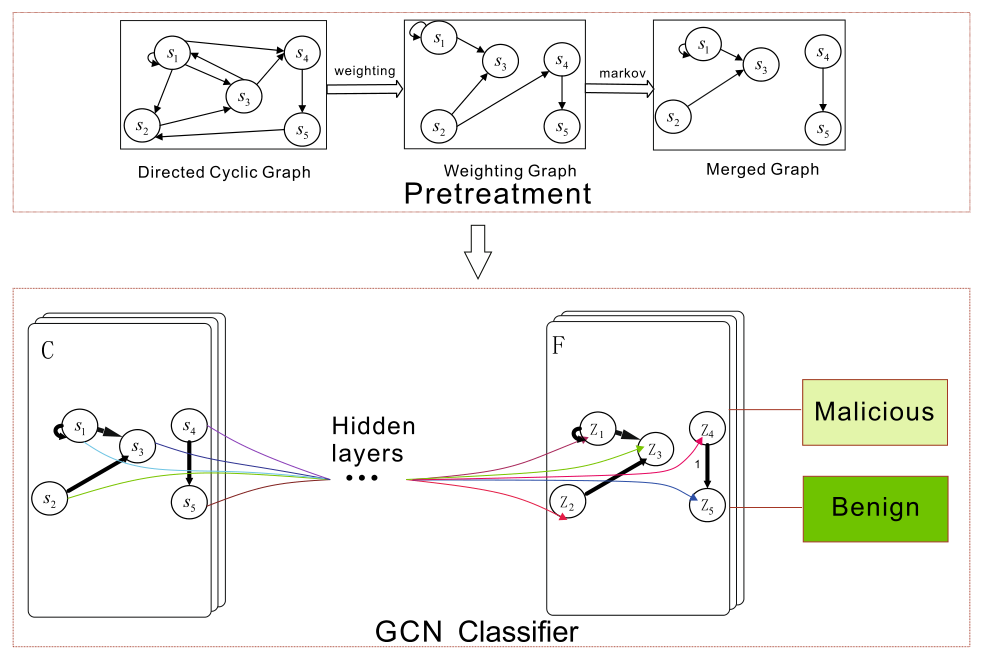
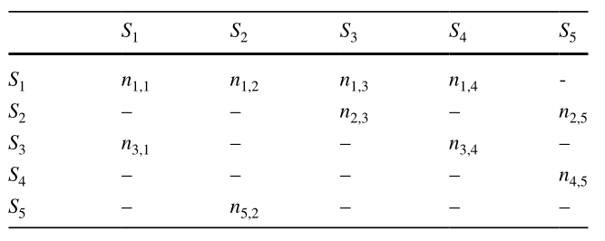

# Intelligent malware detection based on graph convolutional network

长期以来，恶意软件严重威胁着计算机系统的安全。由于反侦查技术的快速发展，基于静态分析和动态分析的传统检测方法的效果有限。 基于人工智能的恶意软件检测凭借其更好的预测性能，近年来被越来越多地用于处理恶意软件。然而，由于恶意软件的多样性，从恶意软件中提取特征是非常困难的，这使得恶意软件检测无法进行人工智能技术的应用。 为了解决这个问题，我们设计了一个基于图卷积网络的恶意软件分类器来适应恶意软件的特征。 具体方法是首先从恶意软件代码中提取API调用序列并生成有向循环图，然后使用马尔可夫链和主成分分析方法提取恶意软件的特征图。

## 1. Introduction

自2020年以来，"COVID-19 "病毒在全世界蔓延，严重影响了全人类的健康和社会的正常发展。 该病毒给人类带来了空前的灾难和恐慌。在网络空间，计算机病毒和其他恶意软件也一次又一次地试图突破计算机的防御，给计算机世界带来破坏。

虽然信息安全部门每年花费大量资金维护网络安全，研究人员也一直试图用更先进的技术来解决信息安全问题，并取得了大量的研究成果，有效遏制了恶意网络攻击带来的危害。 然而，由于信息技术的特殊性，恶意软件开发者往往通过积极寻找系统漏洞来寻找突破口。 另一方面，安全部门往往是在系统被攻破、造成用户损失后才研究识别和防御恶意软件的措施。因此，目前的安全措施往往处于 "后知后觉 "和被动防御的状态。如何预测恶意软件的特征信息，提前发现恶意软件，将恶意软件的传播消灭在萌芽状态，已经成为信息安全研究的一个重要课题。

大多数防御系统仍然以静态分析为主要措施，主要是基于签名匹配[1]。 一些防御系统发展了动态分析，包括敏感行为、访问关键权限、网络分析和关键进程监控作为其辅助方法[2, 3]。然而，所有这些方法都主要集中在特定的恶意软件或恶意软件类别上，因此在防御新类型或变种的恶意软件时受到了限制。 此外，它们对反检测技术也很薄弱，这将使检测器被伪装的恶意软件所欺骗并造成损害。所有这些情况都表明，开发一种新的检测方法是至关重要的。

近年来，深度学习技术已经显示出前所未有的智能程度。通过对大量历史数据的分析，它可以找到规则并预测未知样本。它表现出很强的适应性、预判能力和智能化水平，在计算机视觉、自然语言处理、语音识别等领域取得了良好的效果。 同时，它为恶意软件的检测和防范提供了有效的手段，不仅可以准确地检测出恶意软件，还可以前瞻性地预判未知软件的恶意程度。

本文针对传统静态检测和动态检测方法存在的问题，提出了一种基于应用编程接口（API）调用序列和深度学习算法的新型恶意软件检测方法。 首先，提取了API调用关系，并基于马尔可夫链构建了有序循环图。然后，使用图卷积神经网络（GCN）来检测恶意软件。进行了性能分析和比较。因此，我们工作的主要贡献列举如下：

- 我们提出了一种新的方法，从具有三段式结构的样本中提取特征。首先，我们利用大量已知恶意软件样本的API调用信息，在马尔可夫链的基础上提取恶意软件样本的权重模型，然后用待检测的样本在权重模型中进行映射，从而提取待检测样本的特征。 该模型将测试样本的特征与恶意软件的一般特征相结合，使新生成的特征既能保持样本本身的特征，又能增加特征的通用性，有效抵御恶意软件的伪装和变种。
- 提出了一种基于GCN的恶意代码检测方法。以恶意代码的特征图为输入，对图卷积神经网络工作进行了训练和测试，建立了基于GCN的恶意软件检测模型。该模型利用图作为GCN的输入，提高了模型对恶意代码检测的适应性。

本文的其余部分组织如下。第2部分回顾了一些相关的工作，第3部分介绍了系统框架、工作流程和检测方法。3. 数据集和实验环境在第3节中介绍。4. 第5节介绍了实验的细节和结果，第6节对整个工作进行了讨论和总结。

## 2. Related Work

### 2.1 Development trend of malware

自从计算机诞生以来，恶意威胁一直伴随着计算机的发展。 早在1949年，John von Neumann的论文《复杂自动机的理论和组织》[4]就提到了计算机程序如何实现自我复制的假设，这实际上可以看作是恶意代码的萌芽状态。1970年，BBN技术的开发者Bob Thomas创造了一个叫做爬虫的程序，它可以实现自我复制并通过ARPANET网络继续传播。1983年，Fred Cohen编写了历史上第一个被认可的计算机病毒程序，它可以实现自我复制和传播[5]。 随后，计算机攻击和计算机防御逐渐发展成为一个庞大的产业，而且产业规模也越来越高。恶意代码是指具有恶意的软件，如计算机病毒、蠕虫、间谍软件、浏览器劫持程序、广告软件和跟踪软件等，它们可以控制和破坏用户的计算机、数据和网络，损害用户的利益。如今，随着恶意代码检测技术的不断完善和人工智能技术的发展，恶意代码的技术水平也越来越高。我们想尽一切办法，通过使用逃脱策略来避免检测软件的检测。这些策略比许多传统的反恶意代码系统更聪明、更隐蔽[6, 7]。一般说来，恶意代码的发展趋势是这样的。(1)攻击形式多样，威胁能力的复杂性不断提高。(2) 恶意代码攻击趋于智能化。 (3) 恶意代码已经完全产业化。 (4) 恶意代码攻击有组织。(5)反侦查能力明显提高。

### 2.2 Traditional detection methods for malware

1987年，Fred Cohen首次提出了计算机病毒的概念，并提出了计算机病毒检测和防御的基本理论，建立了程序行为检测的基础，提出了一系列的防御方案，开启了计算机恶意软件防御研究之路。 近十几年来，研究人员经过大量的工作，探索出了一系列检测恶意软件的方法和技术。恶意软件的检测主要是检测恶意软件的特征代码，主要包括基于异常的检测和基于签名的检测。

基于异常的检测技术是通过检测异常程序的行为与正常程序的行为之间的差异来检查程序的恶意性。一般来说，恶意软件的行为轨迹与正常软件的行为轨迹是不一样的。在充分了解正常程序的行为后，将形成一套标准和规范。如果要检测的程序的行为轨迹不正常，违反了这套规范，就可以确定为恶意软件。 基于异常检测的检测方法有三种：静态检测、动态检测和混合检测。

Sundarkumar等人提出了一个基于API调用序列类型的模型，它使用文本挖掘和主题建模来检测恶意软件[8]。 经过分析，它建议使用决策树来设计恶意软件检测专家系统。吴松阳等人以数据流应用程序接口（API）为分类函数，采用改进的k近邻分类模型来检测Android恶意代码。通过机器学习，进一步优化了与数据流相关的API列表，显著提高了敏感数据传输和分析的效率[9]。

### 2.3 AI-based malware detection technology

虽然传统方法在恶意代码检测中发挥了非常重要的作用，也取得了一些成绩[10]。 但是，由于恶意代码编写者经常使用各种手段来规避传统的检测方法，或者研究一些新型的恶意代码或恶意代码的变种，在这种情况下，传统检测模型的准确性就会大大降低。 随着机器学习技术的不断发展，基于机器学习模型的恶意软件检测技术也得到了发展，并取得了一些成功的成果。

Schultz等人介绍了基于静态特征的机器学习，通过使用程序可执行文件（PE）、字节n-gram和字符串进行特征提取来检测未知恶意软件[11]。Elovici等人使用PE和Fisher score（FS）方法进行特征选择，并使用人工神经网络（ANN）、贝叶斯网络(BN)、决策树(DT)及与其他方法检测恶意软件相比，准确率达到95.8 %。Moskovitch等人使用过滤方法进行特征选择。他们使用增益比( GR )和Fisher评分进行特征选择，使用人工神经网络、决策树、朴素贝叶斯( NB )和支持向量机( SVM )分类器进行恶意软件检测，准确率达到94.9 %。他们还提出了一种方法，以n-gram操作码为特征，以文档频率( DF )、GR和FS为特征选择方法，采用人工神经网络、决策树、朴素贝叶斯等分类算法，在ANN、DT、Boosted DT ( BDT )性能较差的情况下，保持较低的误报水平。

Santos等人提出监督学习来检测未知恶意软件。它们采用信息增益方法进行特征选择，并使用不同的分类器，如DT、k -近邻( KNN )、BN、SVM等，其中SVM表现出较好的准确率。Ivan杉木dausi等利用KNN、NB、J48 DT、SVM和MLP五个分类器设计了恶意软件检测技术。实验结果表明，J48 DT取得了最好的整体性能，召回率为95.9 %，误报率为2.4 %，准确率为97.3 %，准确率为96.8 %。总之，可以得出结论，概念的证明基于使用基于自动行为的恶意软件分析和机器学习技术，能够非常有效地检测恶意软件。

Konrad Rieck等人提出了一个利用机器学习自动分析恶意软件行为的框架。该框架可以自动识别具有相似行为的新恶意软件类别(簇)，并将未知恶意软件分配给这些发现的类别(分类)。在聚类和分类的基础上，提出了一种基于行为分析的增量方法，能够每天处理成千上万个恶意软件二进制文件的行为。

为了方便更多的研究人员使用机器学习模型来研究恶意代码检测技术，Anderson 等人。 [17] 为机器学习提供了一个恶意代码基准数据集 ember，然后演示了一个使用 LightGBM 和默认训练的基线梯度增强决策树模型的用例。作者还提出了一个基于强化学习（RL）的静态PE反恶意软件引擎的通用框架。通用框架通过反恶意软件引擎的训练，了解哪些操作序列可以避免检测器中任何给定恶意软件样本的攻击，从而生成可以避免检测的恶意软件样本，为设计更先进的检测软件提供参考.桑杰夏尔马等人。提出了一种基于操作码出现的方法来提高对未知高级恶意软件的恶意软件检测准确性。该方法使用Fisher评分方法进行特征选择，并使用五种机器学习分类器算法来检测未知恶意软件。其中，随机森林、LMT、J48 DT 和 NB 均达到了 100% 的准确率 [18]。

斯米塔海军等。 [19] 提出了一种基于改进的 API 序列的新模型。 通过一系列实验对该方法进行了测试，并将结果与现有的恶意代码检测器进行了对比，证明了该方法的有效性。

唐等人。 [20] 提出了一种基于 API 调用序列的静态恶意代码检测新方法：首先通过动态分析提取 API 序列，然后将序列转换为能够代表恶意代码行为的特征图像。 最后，使用卷积神经网络（CNN）将恶意代码分为九个恶意代码家族。 结果表明，TPR指标超过99%。

李进等。 提出了一种基于权限使用分析的恶意代码检测系统——SigPID。 它使用基于机器学习的分类方法对不同系列的恶意软件和良性应用程序进行分类。 实验结果表明，它可以达到96%以上的准确率。

在拉夫等人的工作中。 [21]，他们使用神经网络在整个可执行文件级别检测恶意代码。 这种解决方案避免了更常见的字节 n-gram 方法的许多问题，但它在两个测试集上实现了一致的泛化。

Alzaylaee 等人。 [22]提出了一种基于深度学习的恶意代码检测系统DL-Droid，动态检测恶意Android应用，利用动态特征实现97.8%的检测率。

作为一种新型的神经网络架构，图神经网络（GNN）近年来在多个行业得到了广泛的应用[23]，但对恶意软件检测的研究还很少。 由于 GNN 使用图作为输入，这与本文研究的 API 调用序列图有关，因此我们尝试在 GNN 中使用一种特殊类型的图卷积网络（GCN）。

## 3. Malware detection algorithm based on graph convolutional network

在本节中，我们将介绍本文提出的基于 GCN 的数据预处理方法和检测器。 首先介绍系统的框架，然后介绍工作流程。

### 3.1 System framework and workflow

该系统主要包括API调用序列的提取、有向循环图的生成、马尔可夫过程和分类四个步骤。 恶意软件检测系统框架如图1所示。

图1 基于图卷积神经网络的恶意软件分类框架

系统工作流程如图2所示。图中左侧为系统流程，右侧为高亮工作，对应的步骤用蓝色曲线表示。 样本首先在沙箱中执行，从中提取样本调用的API，然后将该API作为图的顶点，API调用其他API的次数作为权重 有向边，从而建立有向循环图。 然后，基于马尔可夫链提取特征图，使用GCN分类器进行分类。

图2 基于图卷积神经网络的恶意软件分类工作流图

有向无环图 (DAG) 是具有一组有限点 S 和一组有向边 E 的序列图，而任意边 e 从一个顶点 si 指向另一个顶点 sj (si, sj∈ S)，并且任意 顶点不能用有向边序列返回自己[24]。 DAG 可以表示满足马尔可夫性质的一组可能性，它阐明了从一个状态转换到另一个状态的概率只取决于当前状态。

有向无环图（DAG）广泛用于基于API调用序列的恶意代码分类，但在有循环调用的API序列中使用不方便，因此需要使用有向环图（DCG）。

DCG 类似于 DAG，但允许从顶点到自身的循环。 在我们的工作中，DCG 将由 API 调用序列生成。 该图由表示 API 的顶点 s 和表示调用的边 e 组成，DCG 中的边将根据样本的调用链进行加权。 DCG的结构如图3所示，其中顶点（API）和顶点（调用）之间的关系被简洁地呈现。 对于图 G 中的边 $e_{i,j}$，边的权重是从 API $s_i$ 到 $s_j $的调用次数，在图中标记为$ n_{i,j}$。

为了模型处理的方便，将一个DCG表示为一个邻接矩阵，如表1所示。矩阵中，行表示开始的顶点，即调用的API，列表示结束的顶点 ，即调用的API。 边的权重存储在矩阵的单元格中，这意味着调用发生的次数[25]。

表1 DCG的邻接矩阵表示

当API调用规模较大时，不利于特征提取。 幸运的是，API 调用通常满足马尔可夫属性。 为了有效地提取API调用的特征，我们使用马尔可夫链来提取特征和简化模型，以便于分类。

马尔可夫链是满足马尔可夫性质的无记忆随机过程。 由于马尔可夫链可以简化序列特征的特性，被广泛应用于序列数据的分类和处理，尤其是动态检测[26, 27]。

为了计算权重，首先，将使用原始恶意软件数据集生成马尔可夫链。 数据集必须足够丰富以呈现恶意软件的一般特征，并且链可以定义为“加权图”，可以标记为 $M_w$。 假设 API 数量为 m，则权重图中边 $e_{i,j}$ 的权重 $w_{i,j} $可以计算如下：
$$
w_{i,j}=\frac{n_{i,j}}{\sum_{k=1}^{m}n_{i,k}}\tag{1}
$$
其中 $n_{i,j}$ 表示 API $s_i $对 $s_j $的调用次数，$\sum_{k=1}^{m}n_{i,k}$表示从$ s_i$ 调用的所有调用的总和。 马尔可夫链中权重的本质是事件发生的概率。 因此，从 API $s_i $调用的权重之和必须为 1：
$$
\sum_{k=1}^{m}w_{i,k}=1\tag{2}
$$
在加权阶段，最终的权重必须符合调用的敏感性和样本本身的特征。 因此，最终图将由相邻矩阵 M（从样本生成）和加权图 $M_w$ 的合并生成。 合并过程如图 4 所示。合并后的图将只保留 M 和 $M_w $中都存在的边（调用），从$ s_i $到$ s_j $的调用的最终权重 $W_{i,j }$可以计算如下：
$$
W_{i,j}=w_{i,j}\cdot n_{i,j}\tag{3}
$$
其中$n_{i,j}$是相邻矩阵M中(i,j)的值，即样本中出现调用$e_{i,j}$的次数。 检测的最终输出是表示合并图的矩阵，如表 2 所示。

表2 融合图的邻接矩阵表示

### 3.3 GCN‑based malware classification algorithm

由于每个生成图的结构不同，邻接矩阵的维数也不同，使用传统的神经网络需要统一维数，这将是一项繁琐的工作。 幸运的是，图卷积网络可以处理任何结构的图，因此在本文中，我们尝试使用图卷积网络对生成的图进行分类。

在图 1 的分类器模块中，展示了一个典型的图卷积网络结构架构。 它有 C 个输入通道和 F 个输出特征图，并且可以包含多个隐藏层 [28]。 加载一个图到GCN，通过几层GCN，每个节点的特征从S到Z变化，然后完成分类。

在我们的实验中，我们设计了一个基于生成的加权特征矩阵$R$的两层半监督分类 GCN。 在正向阶段，计算如下：
$$
\hat{R}=\tilde{D}^{-\frac{1}{2}}\tilde{R}\tilde{D}^{\frac{1}{2}} \tag{4}
$$
其中，$\tilde{R}=R+I$，$I$为单位矩阵，$\tilde{D}$是矩阵$\tilde{R}$的度矩阵，然后我们定义以下前向传播模型：
$$
Z=f(X,R)=\text{softmax}(\hat{R}\ \text{ReLU}(\hat{R}XW^{(0)})W^{(1)}) \tag{5}
$$
其中，$W^{(0)}$为输入层至隐藏层的权重向量，$W^{(1)}$为隐藏层至输出层的权重向量，ReLU函数定义为$\text{ReLU}(x)=\max(0,x)$。由于是二分类问题，所以softmax函数定义如下：
$$
\text{softmax}(p_i)=\frac{e^{p_i}}{e^{p_1} + e^{p_2}} \tag{6}
$$
这里$p_1+p_2=1$。在反向传播阶段，使用了交叉熵损失函数：
$$
L=-\sum_{i=1}^N[y_1^{(i)}log(p_1^i) + y_2^{(i)}log(p_2^i)],(i=1,2,\dots,N)\tag{7}
$$
其中，$N$为样本数量，$y$为标签值，$p$为概率。

## 4. Dataset and experiment design

在这项工作中，我们收集了一个由 13,624 个样本组成的数据集，其中包含 6686 个恶意软件和 6938 个良性样本。 详细统计数据见表3。恶意样本来自VirusTotal和VirusShare，良性样本来自系统程序和互联网。 良性数据集被平均分为五个部分，以适应每年恶意软件数据集的数量。 在我们的实验中，数据集设置为 80% 用于训练，20% 用于评估。 对于加权模型，采用 API 日志数据集进行训练。 加权数据集包括从 Virusshare 获得的 62307 个恶意软件样本，这些样本是随机选择的，以保证加权模型的通用性。

实验在 Ubuntu 18.04 系统的工作站上进行。 为了监控和提取每个样本的调用序列，在工作站上部署了布谷鸟沙箱作为样本小节加权和图生成的运行环境。 在这个阶段，首先对提取的呼叫序列进行编号。 然后，将序列转换为 DCG。 DCG 的索引表示对应的 API，每个单元格中的值指的是前一个 API 调用的 API 的出现编号。 生成 DCG 后，将图与加权图混合，从而创建每条边具有唯一值的加权 DCG。

在加权阶段，首先，从数据集中训练加权图。 训练后的初始加权图有 1609 行和列。 然后，使用加权图生成合并图进行检测。

## 5. Experiments and results analysis

### 5.1 Detection and evaluation methods

在分析结果之前，先介绍几种常见的检测和评价方法。

准确度是衡量预测准确度的标准指标。 精度是指预测的正样本中真正为正的数量。 召回率是样本中被预测为正例的正例数。 F1-Score是分类模型的综合衡量指标。 所有这些指标都可以计算为以下等式：
$$
Overall Accuracy = \frac{TP+TN}{TP+TN+FP+FN}=\frac{TP+TN}{P+N} \\
Precision_M=\frac{\sum _i \frac{TP_i}{TP_i + FP_i}}{Number\ of\ Classes} \\
Recall_M==\frac{\sum _i \frac{TP_i}{TP_i + FN_i}}{Number\ of\ Classes} \\
F1-Score_M = \frac{2}{\frac{1}{Precision_M} + \frac{1}{Recall_M}}
$$
其中TP是True Positive，指的是被预测为正的正样本的数量。 FN是False Negative，即被预测为负的正样本的数量。 FP是False Positive，表示被预测为正的负样本的数量。 TN 是 True Negative，即被预测为负数的负样本数。 在我们的工作中，恶意样本被标记为阳性，良性样本被标记为阴性。

### 5.2 Classification results and analysis

在我们提取 API 调用序列图后，我们分析了示例 API 调用序列和相应的权重。

图 5 为随机选取的四组样本的散点图，其中 X 轴为调用他人的 API 序列号，Y 轴为他人调用的 API 序列号，Z 轴为 API 调用的权重。 从图中我们可以发现，良性样本的分布点比恶意样本的分布点更分散。 此外，良性样本中 API 调用的权重比恶意样本更多样化。

图5 最终合成图的散点图

表 4 显示了具有不同年份数据集的模型的评估结果。 结果表明，模型之间的性能存在明显差异。 对于基于机器学习的模型，它们中的大多数在大多数数据集的检测中表现良好。 GCN在评价中整体表现比较好，大部分指标领先于其他模型，CNN模型比较接近，这和它们的分类原理有关。 此外，随着年份的增加，预测精度也有一定程度的下降。 我们认为样本的抗检测能力得到了一定程度的提升。 特别需要注意的是，在2020年的数据中，GCN的检测指标高于其他模型，这说明GCN模型对检测能力强的模型有更好的分类效果。

表4 不同数据集下模型评估

结果表明，在大部分基于机器学习或深度学习的模型中，该方法对一般恶意软件的检测都有较好的表现，证明了该方法的有效性。

我们将其他方法与我们的模型进行了比较，以测试模型的性能。 表 5 介绍了我们的模型性能与其他基于深度学习或机器学习的现有恶意代码检测方法的比较结果。 如表 5 所示，所有方法的 TPR 均超过 99%。 此外，我们方法的 FPR 低于其他方法，因此我们提出的方法在 FPR 和准确性方面优于其他方法。 我们的模型性能更好的原因是随着恶意代码数据集的增加，我们提取的恶意特征更加准确，模型更加健壮。

表5 GCN和现存方法分类结果的比较

## 6. Conclusion

恶意软件源远流长，严重威胁着计算机系统的安全。随着反检测技术的飞速发展，传统的基于静态分析和动态分析的检测方法能力有限。由于神经网络具有很强的预测性能，人工智能技术在恶意软件检测中的应用已成为研究热点。但由于恶意软件的不同，特征提取困难，不利于传统神经网络的应用。为了解决这个问题，我们利用 GCN 输入的灵活性设计了一个基于 GCN 的恶意软件检测器，以适应恶意软件的差异。具体方法是从恶意代码中提取API调用序列生成有向循环图，利用马尔可夫链提取图的特征，再利用GCN实现分类。我们还与其他机器学习算法进行了评估。结果表明，该方法在大多数检测中具有较好的性能，最高准确率为98.32%。通过研究，我们发现该技术具有潜在的适应性，但尚未实现。在未来的工作中，我们将重点研究基于GCN的自适应检测模型，使恶意软件检测系统具有更强的自适应能力，从而降低恶意软件检测人员的成本。

