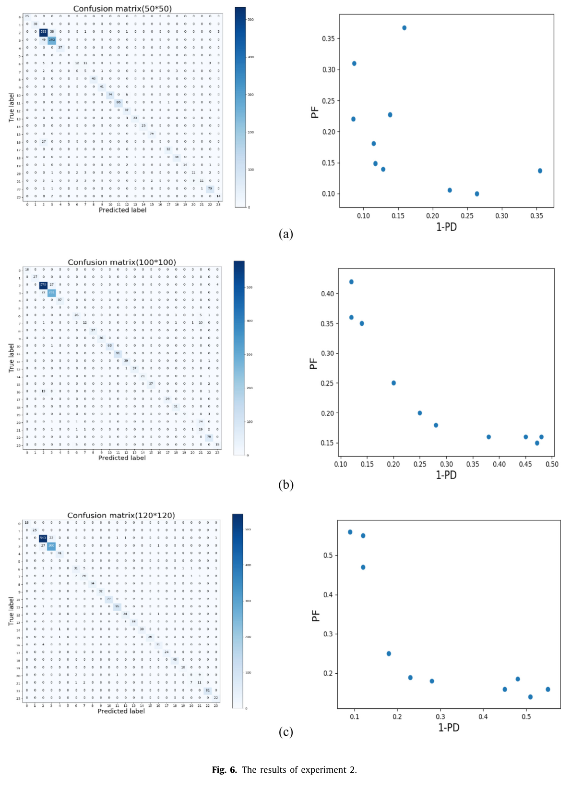

## Malicious code detection based on CNNs and multi-objective algorithm

越来越多的恶意代码通过威胁用户隐私作为网络安全漏洞的主要来源之一，对互联网造成伤害。 恶意代码的检测变得越来越重要，目前的检测方法需要很大的改进。 本文提出了一种使用卷积神经网络 (CNN) 和智能算法推进恶意代码检测的方法。 CNN 用于识别和分类从恶意代码的可执行文件转换而来的灰度图像。 然后使用非支配排序遗传算法II（NSGA-II）来处理恶意软件家族的数据不平衡。 视觉研究实验室针对恶意软件图像数据设计了一系列实验。 实验结果表明，该方法是有效的，保持了较高的精度和较少的损失。

## 1. Introduction

社会已进入大数据时代。 如今，人工智能、语音识别、图像识别、推荐算法等便捷的智能算法随处可见，并被热切使用。 数据在推动算法不断更新和改进方面发挥着重要作用。 在科学研究和产品开发过程中，算法会收集和利用各种用户数据。 当这种情况发生时，数据被暴露，并且使用各种方法来获取这些私有数据。 在讨论隐私时，强调“单个用户”，在隐私领域将不考虑一组用户的某些属性。

近期，Facebook等具有较大影响力的国际公司发布个人身份信息备受关注。 Facebook 的信息泄露丑闻引发的麻烦，让很多企业开始反思网络安全和信息保护的必要性。网络安全也越来越受到互联网用户的关注，恶意代码[13]等威胁网络安全的重要因素越来越受到关注。恶意代码可以通过获取非法权限来读取隐私数据，是对隐私安全和保护的极大威胁[14]。根据 2018 年赛门铁克互联网安全威胁报告，硬币挖掘是 2017 年网络犯罪增长最大的领域，反病毒检测率上升了 8500%。针对物联网设备的攻击也增加了 600%。此外，赛门铁克还报告称，将恶意软件植入物注入供应链以渗透毫无戒心的组织的攻击者有所增加，此类攻击增加了 200%。与前几年每年四次攻击相比，这在 2017 年每个月都会发生一次。同时，报告显示，移动用户还面临来自灰色软件应用程序的隐私安全风险。虽然这些应用程序并不完全是恶意的，但它们会给用户带来很多麻烦，并且这些技术的发展给恶意代码的检测带来了挑战[24,36,45]。

近年来，检测恶意代码的方法发展迅速[23]。由于图像场技术的发展[22]，卷积神经网络（CNN）的使用在今天非常普遍。一些学者 [10] 已经使用 CNN 与智能算法一起识别和分类恶意软件图像，以处理恶意软件家族的平衡问题。这种方法极大地提高了模型的准确性，并且在恶意软件数据集上运行良好。但是，也有一些不合理之处。单一的评价标准不能代表所建模型的性能。例如，在 CNNs 模型中经常出现模型的准确率非常高，但召回率不是很好的情况。原因是建立的模型没有仔细考虑数据集的不平衡性[18]。处理不平衡数据的能力不足。为了弥补这一不足，评价一个模型需要各种标准，更多的标准从不同方面证明了模型的有效性。

因此，本文采用了不止一个标准来评估模型。越多的准则就需要相应的算法来处理。于是，多目标算法进入了我们的视野[7,8,11,22,26,44]。多目标算法可以有效地处理不平衡问题[48]。近年来，多目标算法得到了发展[1,3,4,16,32,43]。在多目标领域[2,9,25,42,49]上提出了越来越多的策略和方法。多目标算法也与其他算法相结合来处理各种问题[12,28,37,40]。非支配排序遗传算法II已被应用到各个领域[50]。 CNNs 和 NSGA-II 在相关领域都有很好的表现。因此，我们将 CNN 与 NSGA-II 结合起来处理恶意代码的检测。在这里，非支配排序遗传算法II（NSGA-II）用于管理恶意软件图像的不平衡问题，然后使用CNNs对恶意软件家族进行识别和分类。所提出的方法可以避免数据集不平衡带来的问题，结果表明该方法在恶意软件数据集上表现良好。

本文的其余部分的结构如下。 第 2 节介绍了相关工作，包括恶意软件检测方法。 第 3 节介绍了本文使用的方法和原则。 第 4 节讨论了基于 CNN 和 NSGA-II 的建议方法。 第 5 节介绍了在相关数据集上进行的实验，最后，第 6 节讨论了结论。

## 2. Related work

本节介绍和讨论了有关恶意软件检测的相关研究和现有的检测方法。基于特征分析的检测方法分为静态方法和动态方法两大类。

静态方法是一种常用的现有方法。布赖恩等人[5] 开发了一种通过静态分析查找源代码中的安全漏洞的方法。他们还证明了该方法可用于识别现有程序中的真正漏洞。然而，这种方法的一个问题是静态分析的有效性受到混淆技术的极大影响[27]。

为了处理代码混淆，Sharif 等人。 [35] 提出了一个框架，用于检测可执行文件中的恶意模式，该框架对常见的混淆转换具有弹性。该研究证明了该架构的功效；然而，该方法仅限于指令级别的特征提取和分析，并且存在许多容易欺骗静态方法的技术。

动态分析基于对访问私有数据和使用受限 API 调用等行为的评估来监控和分析应用程序的运行时特性。给定这些信息，建立行为模型来检测恶意代码。此类技术已显示出改进的检测性能，但仍受到为产生不可靠结果而开发的各种对策的挑战[30]。

此外，由于需要大量计算，动态分析非常耗时，在暴露于大型数据集时会导致效率低下。

如前所述，恶意代码可视化的方法已经成功使用[34,39]。柳等人[31] 利用自组织地图来可视化计算机病毒。 Trinius 等人提出了一种类似但扩展的方法 [10]，他使用两种可视化技术，树图和线程图，来检测和分类恶意软件。 Goodall 等人并没有获得单一的检测结果 [17]，而是将不同恶意软件分析工具的结果聚合到一个可视化环境中，增加了单个恶意软件工具检测覆盖率的脆弱性。

上面讨论的研究主要集中在恶意软件行为的可视化[38,41,46]，然而，软件源代码可能提供更有意义的模式。如前所述，Nataraj 等人 [29] 提出了一种基于二进制纹理分析的恶意软件检测的新可视化方法。首先，他们将恶意软件可执行文件转换为灰度图像，然后根据这些图像的纹理特征识别恶意软件。与动态分析方法相比，这种方法产生了等效的结果[29]。在类似的工作中，Han 等人[15] 将恶意软件二进制信息转换为彩色图像矩阵，并使用图像处理方法对恶意软件家族进行分类。但是他们使用的方法有一个缺点是资源消耗高。一旦恶意软件被可视化为灰度图像，恶意软件检测就可以转化为图像识别问题。在 [30] 中，Nataraj 等人。使用广义搜索树 (GiST) 算法来提取恶意软件图像的特征。然而，GiST 算法的操作是耗时的，并且最近已经提出了更强大的图像处理技术。

对于图像融合，Miao 等人[26]提出了一种基于剪切波和遗传算法的图像融合算法。在他们的方法中，采用遗传算法来优化融合规则中的加权因子。实验结果表明，与其他方法相比，该方法可以获得更好的融合质量。崔等人 [10] 开发了一种将 CNN 与 Bat 算法相结合的方法，以提高模型的准确性。 Bat算法用于平衡图像数据集，卷积神经网络用于图像识别和分类。但是他们使用一种评估标准来测试模型。正如我们在第 1 节中所述，单一评估标准不能代表所构建模型的性能。

深度学习 [33,47] 是机器学习研究的一个领域，近年来从人工神经网络的工作中脱颖而出。神经网络可以通过学习深度非线性网络结构来利用近似复杂函数来解决复杂问题。近年来，多目标问题的算法得到了很好的发展。本文提出了基于深度学习和多目标算法的恶意软件检测。 CNN 可以方便地训练识别出的模型。 NSGA-II 可以处理数据集的不平衡问题。所以我们可以有效地避免上面总结的问题。

## 3. Method and principle

本节介绍了该方法中使用的一些方法和原理，包括恶意代码可视化、CNNs 和 NSGA-II。

### 3.1 Visualization of malicious code

恶意代码的可执行二进制文件可以通过算法划分为 8 位长度。 每 8 位可以转换为 0 到 255 范围内的无符号整数（一个灰度像素）。 然后根据[29]中提供的一定宽度将它们组合成一个二维数组。 这样就可以将二维图像映射为灰度图像。 图 1 显示了转换过程。 

图1 恶意代码可视化流程图

通过转换过程可以看出，同一种恶意软件家族具有相同的纹理和特征。 因此，CNN 可用于识别和分类从恶意代码的可执行二进制文件转换而来的灰度图像。

### 3.2 Structure of CNN

卷积神经网络是最近的神经网络发展，引起了广泛关注[20]。 CNNs主要用于图像的重组和分类。神经网络是一种操作模型，其中大量节点（或神经元）相互连接。每个节点代表一个特殊的输出函数，称为激活函数。两个节点之间的每个连接都由称为权重 [6] 的连续信号的加权值表示。权重相当于神经网络的记忆。由于连接方式、权重值和激活函数，神经网络的输出是不同的。网络本身通常是算法或函数的近似，或者是逻辑策略的表达。

本文使用的神经网络结构有两个卷积层、一个池化层和两个密集层。其结构如图 2 所示。

1) 卷积层 

   CNN 的卷积层由若干个卷积单元组成。卷积是图像处理中常用的线性滤波方法。卷积的前提是提取输入图像的不同特征。卷积层的计算公式如下：
   $$
   FM_{i,j}=f(\sum_m\sum_nw_{m,n}x_{i+m,j+n}+w_b) \tag{1}
   $$
   $x_{i,j}$ 表示图像输入的第$ i $行和第$ j $列像素。$ w_{m,n}$ 表示滤波器的第 m 行第 n 列像素。$ w_b$ 代表偏差。 这里的$ f $代表激活函数。 使用的激活函数是整流线性单元 (ReLU)。 $FM_{i,j}$ 表示特征图输出的第$ i $行和第$ j $列元素。 ReLU如下：
   $$
   f(x)=\max(0,x) \tag{2}
   $$
   即取$x$和0较大的值为输出。

2) 池化层

   池化层主要是下采样，就是降维。 通过在特征图中取出不必要的样本来减少参数的数量。 池化的方法有很多，作者通常使用均值池化和最大池化。 Mean pooling 将图像区域的平均值计算为该区域的池化值，而在 max pooling 中，图像区域的最大值是该区域的池化值。 本文使用最大池化。

3) 全连接层

   在卷积和池化之后，CNN 中有密集层。 密集层中的每个节点都与前一层中的所有节点完全连接。 密集层的作用是在卷积层或池化层中将局部信息与类别区分进行整合。 本文使用的dense layer的激活函数是ReLU。 使用的最后一层的输出是 softmax 回归。

### 3.3 NSGA-II

智能优化算法是一种启发式算法。 它受到优化问题的挑战，但对于非确定性优化问题表现良好。

通常，具有 2∼3 个对象的优化问题称为多目标优化问题 (Multi-objective optimization problems, MOP) [21]。 MOP的定义如下：
$$
\min f(X)=\min [f_1(X),f_2(X),\dots, f_m(X)] \\
X=(x_1,x_2,\dots, x_n)\in R^n \\
\begin{cases}
g_i(X)\ge0,i=1,2,\dots,k\\
h_j(X)=0,j=1,2,\dots,p
\end{cases} \tag{3-5}
$$
其中$f_m(X)$为第$m$个目标函数，$X$为满足以上约束条件的$n$维解向量。$R^n$为解空间，$g(X)$和$f(X)$分别为不等式约束和等式约束。

本文中的不平衡数据集可以看作是一个MOP，使用的是NSGA-II算法。

1. Srinivas 和 Deb 等人。 1993 年提出了 NSGA [17]。 NSGA 的缺点是共享参数，构建帕累托最优解集的时间复杂度太高，以及
2. 没有最优的个体保留机制来缓解这些问题，Deb 等人[19] 2000 年提出了基于 NSGA 的 NSGA-II 。NSGA-II是目前广泛使用的一种精英策略的非支配排序遗传算法。 NSGA-II 的重要方面包括快速非支配排序和拥挤距离的计算。

为了保持解决方案组的分布和多样性，Deb 等人提出计算进化种群中每个个体的拥挤距离，然后根据个体的层数和拥挤距离，定义一个偏序集。然后在以偏序集构建新种群时依次选择个体。

在这里，当新的种群产生时，一般会保留合适且聚集密度小的个体，然后再参与下一次进化。聚集密度小的个体聚集距离较大。通过计算每个子目标上相邻两个个体的距离差之和，可以得到个体的聚合距离。 NSGA-II 的特性意味着它可以用于所提出的方法。

## 4. Proposed work

不平衡的数据集将对模型的结果产生负面影响。如图 3 所示，一些恶意软件图像的数量比其他的要大得多。为了解决这个问题，如第 2 节所述，一些学者提出使用单目标算法来处理不平衡问题。但是，该技术具有局限性，因为单一的评估标准无法正确评估模型。

建议使用多目标算法来处理数据集的不平衡问题。提出了重采样方法，通过处理训练集并生成平衡数据集来解决不平衡数据集。该技术由两种实现方式组成：过采样和欠采样。欠采样用于从样本集中删除特定样本。我们在本文中使用欠采样。

设计思路是通过NSGA-II在迭代算法中实现求解。我们用它来优化多个恶意软件家族的采样权重，即每种恶意软件家族的数量。假设恶意代码家族的数量为 N，每种恶意软件家族的数量记为$w_i, i\subset N$。对于这种优化，种群中的每个个体是由以下等式给出的采样数量的组合：
$$
quantities = w_1, w_2, \dots, w_n \tag{6}
$$
根据该解决方案，将与图像数量对应的部分输入到神经网络中进行训练。 训练后，使用数据集的其他元素验证模型。 计算真阳性率和假阳性率。 然后“1- True Positive Rates”和 False Positive Rates 作为 NSGA-II 的两个对象。 所以我们使用 NSGA-II 通过串行循环和迭代操作获得最好的两个对象，然后可以得到结果。 算法伪代码如下。

通过伪代码可以看出，恶意软件家族的数量可以看成一个个体。 NSGA-II 是复杂优化问题的有效解决方案，因此用于获取解决方案。 目标值将从 CNN 的训练中获得。 1-TPR 和 FPR 是两个目标函数（第 5 节）。 我们画出图中的帕累托集。 并且我们选择了1-TPR和FPR同时都少的方案。 该方法的目的是找到满足评估标准的最佳个体。

## 5. Experimental evaluation

### 5.1 Dataset and evaluation criterion

本文使用的数据集是来自 Vision Research Lab 的恶意软件图像数据。在这里，选择了 24 个进行实验。另外，为了实验方便，我们使用$50\times50、100\times100$和$120\times120$分辨率的图片。每个恶意代码的数量如下： 

通过图4中的表格可以看出，不同种类的数量差异很大。通过解决不平衡问题可以避免过度拟合或不良状态。

正确选择评估标准对于评估模型的优劣至关重要。在分类问题中，混淆矩阵用于评估分析模型。对于二分类问题，可以按照真实类别和预测类别对样本进行如下划分： 

- 真阳性（TP）：真实类别为阳性，预测类别为阳性。
- 假阳性（FP）：真实类别为阴性，预测类别为阳性。
- 假阴性（FN）：真实类别为阳性，预测类别为阴性。
- 真阴性（TN）：真实类别为阴性，预测类别为阴性。

混淆矩阵的创建如表 5.1 所示。

表5.1 混淆矩阵

通过混淆矩阵，可以计算出其他评价指标包括： 准确率，代表所有模块正确预测的比例：
$$
Overall Accuracy = \frac{TP+TN}{TP+TN+FP+FN}=\frac{TP+TN}{P+N}\\
Precision_M=\frac{\sum _i \frac{TP_i}{TP_i + FP_i}}{Number\ of\ Classes} \\
Recall_M==\frac{\sum _i \frac{TP_i}{TP_i + FN_i}}{Number\ of\ Classes} \\
F1-Score_M = \frac{2}{\frac{1}{Precision_M} + \frac{1}{Recall_M}}
$$
多目标平衡问题一般选择TPR和FPR作为需要处理的对象。

然而，这些评价指标涉及两个分类问题。本文的问题属于多类分类，因此需要一种计算 TPR 和 FPR 的方法。

预测结果表明，预测样本有的大于真实样本，有的少，有的与真实样本相同。因此，根据类别的数据集数量将预测样本分为两部分。例如，本文使用的类别数据集数量为 24。因此我们将类别 1 到 12 视为前半部分，将类别 13 到 24 视为后半部分。案例见表 5.2。

按照这个过程，就可以计算出上面的评价指标。该方法通过实验验证显示出强大的性能。交叉熵损失函数描述了两个概率分布之间的距离，交叉熵越小，两者越接近。交叉熵是一种广泛用于分类问题的损失函数。给定两个概率分布 p 和 q，p 的交叉熵由 q 表示如下：
$$
loss(p,q)=-\sum_ip(x)log(q(x)) \tag{10}
$$
交叉熵描述了两个概率分布之间的距离，但神经网络的输出不一定是概率分布。 概率分布描述了不同事件的概率。 当事件总数有限时，概率分布函数$ p(X = x) $满足：
$$
\forall x,p(X=x)\in[0,1] \&\sum_x p(X=x)= 1\tag{11}
$$
Softmax回归是将神经网络前向传播的结果转化为概率分布的常用方法。 Softmax回归本身可以作为一种学习算法来优化分类结果，但是在TensorFlow中，Softmax回归的参数被去掉了，只是额外的一层处理，将神经网络的输出变成了概率分布。 因此，我们可以使用损失函数值来评估我们建立的模型的效果。

### 5.2 Experimental results

为了验证所提出方法的有效性和效率，设计了实验以验证以下内容：

1. 使用的数据平衡方法将如何影响结果；
2. 图像分辨率对实验结果的影响。

实验一旨在验证不同数据均衡方法对结果的影响。结果在表 5.3 中提供。

结果表明，准确率和召回率都有很大的提高，同时损失和 TPR 也有所降低。与单目标算法相比，该方法对恶意软件图像数据集有积极的影响。混淆矩阵如下。

从图5（a）、（b）和（c）可以看出，在没有数据均衡的情况下，（c）中的混淆矩阵要好于（a）和（b）中的混淆矩阵。没有数据均衡的训练可能会导致过拟合。多目标算法在恶意软件图像数据集上表现出最好的效果，数据平衡有效地处理了这个问题。

第二个实验旨在验证图像分辨率对实验结果的影响。如表 5.4 所示，如果图像分辨率较大，则可以提高精度并减少损失。召回和 TPR 也得到了增强。

在图 6 中，可以看出图像的分辨率对结果至关重要。更高的分辨率将获得更高的精度和更少的损失。图 6 中可见的帕累托最优前沿清楚地说明了图像分辨率对数据集的巨大影响。

## 6. Conclusion

在本文中，提出了一种使用 NSGA-II 来平衡数据集的方法。首先，二进制文件将恶意代码的可执行文件转换为灰度图像，然后使用 CNN 对图像进行识别和分类。发现不平衡的数据集对实验结果有负面影响。此外，发现 NSGA-II 在不确定问题上表现得非常好。因此，选择 NSGA-II 来平衡数据集。基于深度学习的恶意代码检测与传统方法相比有很大的改进，实验结果验证了本文提出的方法的有效性。在这项研究中，提高了准确性并减少了模型的损失。我们在本文中进行了 $50*50、100*100 $和$ 120*120 $分辨率问题的工作。但在自然界中，图像的分辨率远大于这些。我们将在未来的工作中对更大规模的图像进行更多的研究，未来的研究也将集中在减少时间和加速网络训练上。