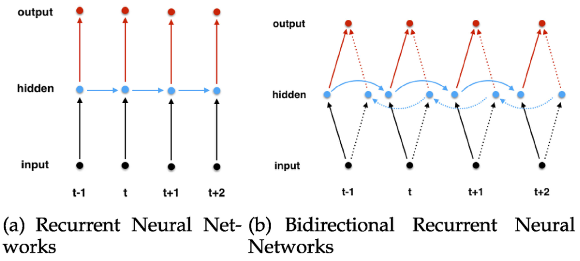

# Deep Learning and Visualization for Identifying Malware Families

恶意软件日益增长的威胁正变得越来越难以忽视。本文采用一种恶意软件特征图像生成方法，将恶意代码的静态分析与循环神经网络(RNN)和卷积神经网络(CNN)方法相结合。该方法不仅考虑了恶意软件的原始信息，还考虑了原始代码与时序特征的关联能力;此外，该过程减少了对恶意软件类别标签的依赖。然后，利用minhash算法将原始编码与RNN的预测编码融合生成特征图像。最后，我们训练一个CNN对特征图像进行分类。当我们训练的样本很少时(训练数据集的样本大小与验证数据集的比例为1:30)，我们获得了92%以上的准确率。当比例调整为3:1时，准确率超过99.5%。由混淆矩阵可以看出，我们的方法得到了很好的结果，其中恶意软件族中最坏的误报率为0.0147，平均误报率为0.0058。

## 1. Introduction

MALWARE是恶意软件的缩写。这类软件是专门设计来未经许可地入侵或破坏计算机，并且增长非常快。Symantec[1]发布的一份网络安全威胁报告显示，2015年发现了超过4.3亿个新的独特的恶意软件，比前一年增长了36%。随着计算机技术在日常生活中的影响越来越大，恶意软件(也称为恶意代码)对现代生活的威胁越来越大。例如，2017年5月12日星期五，一种加密勒索软件蠕虫WannaCry遭到攻击，影响了150多个国家的20万个人[2]，[3]，[4]。PC、智能手机，甚至你家或办公室周围联网的智能设备都有可能受到成千上万条恶意软件的攻击。攻击者可以获得巨额利润，而且很难追踪到。

目前，根据程序是否被执行，恶意代码分析可分为静态分析和动态分析[5]。传统的静态分析非常快速和强大，但当恶意代码使用压缩或加密的二进制文件时，它不能很好地工作。此外，一些现代恶意软件是使用欺骗技术编写的，以躲过这种类型的分析。混淆背后的基本思想是，要么将原始代码中的一些指令替换为语义等价但更难分析的程序片段，要么向程序中添加不改变其行为[6]的额外指令。当使用动态分析时，恶意软件设计人员会测试调试器，并需要一些输入或使用其他规避技术来挫败动态分析。

近年来，深度学习技术在许多领域都取得了突破性的成果。循环神经网络[7]是最强大的神经网络，已应用于语言模型[8]、在线手写识别和生成[9]、语音识别[10]。卷积神经网络(CNN)[11]也在图像识别领域占据主导地位。在这里，我们将深度学习应用于计算机安全；一些研究人员尝试使用rnn进行恶意软件检测和分类[12-15]。

在本文中，我们提出了一种名为RMVC的静态分析方法，它是RNN、minhash、visualization和CNN四个词的首字母组合。我们使用RMVC来分析汇编语言的操作代码，完成恶意代码的分类。rnn擅长处理顺序信息，我们用它来处理汇编语言的操作代码。Minhash[16]可以生成相同维度的特征。cnn擅长处理网格信息，恶意代码的可视化也取得了很好的效果。这些技术也可以结合使用。特别是由于RNN，我们的方法有能力获得关于恶意代码的知识，而不需要类别标签。

我们的方法的优势在于：

1. 我们使用 RNN 的方法：我们没有使用来自隐藏层的信息。 神经网络是黑盒子，隐藏层中的信息太抽象而无法解释。 我们使用 RNN 生成的预测操作码并增加使用 RNN 的可解释性。 此外，当我们分析恶意代码时，我们还将原始操作码与预测代码结合起来。
2. 较少的类别标签命令：本文的主要工作是多分类。 没有足够的分类标签数据，所以如何利用好无标签数据至关重要。 在我们的方法中，RNN 可以在不知道类别标签的情况下从恶意软件中获取知识。
3. 使用恶意代码可视化的新方法：CNN 在图像处理方面的巨大成功使得恶意代码可视化流行起来。 将信息处理到同一维度是很棘手的。 我们应用 minhash 从不同大小的恶意代码中提取相同维度的信息，然后将它们映射到相同维度的图像中。 恶意代码更接近文本信息而非图像。 可视化越晚，效果越好。 它可以保留更多的信息，也可以使用强大的CNN。
4. 出色的泛化性：当涉及到非常小的训练数据集测试时，与传统方法相比，我们的方法将准确率提高了 10% 以上。
5. 传统的 N-gram 马尔可夫链和其他序列分析方法已经发展了很长时间 [17]、[18]。 我们希望以一种新颖的可视化方式来解决这个问题，并将恶意软件的可视化分析过程模块化，以适应不同的可视化方法。

本文的结构如下。 与恶意软件相关的研究在第 2 节中进行了描述。在第 3 节中，提出并更详细地讨论了 RMVC 算法。 第 4 节介绍了实验结果，第 5 节总结了整篇论文。

## 2. Related Work

### 2.1 Malware Analysis

恶意软件分析方法可分为静态分析和动态分析两种。静态分析通过反汇编或反编译恶意软件二进制文件而不执行它来检查代码。由于舒尔茨等人 [19]引入了用于检测恶意软件的数据挖掘概念，研究人员在静态分析方面做了大量工作，例如在n-grams输入中应用的朴素贝叶斯[17]、对木马进行分类的函数长度频率[20]、基于恶意软件的结构信息（函数调用图）的自动恶意软件分类框架[21]。尽管程序的所有执行过程都将反映在代码中，但在大多数情况下，静态分析并非易事，因为攻击者使用代码混淆，例如二进制打包器、加密或自修改技术来逃避静态分析。动态分析不会受到混淆的影响，因为它会在 TTAnalyzer [22] 和 CW Sandbox [23] 等沙箱中分析恶意软件在执行期间的行为。沙盒由虚拟机和保护操作系统免受损坏的模拟环境组成。沙箱在受控环境中执行恶意软件样本，可以动态监视和记录有关系统调用和行为的信息，这些信息用于确定程序是良性的还是恶意的 [23]、[24]、[25]。然而，动态分析只是模拟程序的一个很短的时间范围，有时它不能触发执行程序的所有部分。 

2010 年，Nataraj 等人[26]提出了一种可视化恶意软件的方法。恶意软件二进制文件可以以 8 位无符号整数的向量进行读取，然后组织成二维数组。这可以可视化为灰度图像。这种可视化方法直观地展示了不同类型恶意软件的特征，为恶意分析提供了一种新途径。观察到对于许多恶意软件家族，属于同一家族的图像在布局和纹理上看起来非常相似。受这种视觉相似性的启发，目前已提出了一种使用标准图像特征的分类方法和几种可视化技术 [27-34]用于恶意软件分析。

### 2.2 RNN and CNN

循环神经网络 [7] 对于处理序列数据很有用。与传统的神经网络不同，如图 1a 所示，RNNs具有特殊的循环结构，它保留了先前输入的信息。 RNN 比看起来要深得多。循环神经网络不仅将当前隐藏层的输出传递给下一层，而且在下一个点将输出作为当前隐藏层的输入。 RNN可以在时间维度上进行扩展，实际层数远大于传统的前馈神经网络。然而，有时预测不仅取决于先前输入的信息，还取决于整个输入序列。为了克服常规 RNN 的局限性，Schuster 和 Paliwal [35] 提出了一种双向循环神经网络（BRNN），可以使用特定时间框架过去和未来的所有可用输入信息进行训练（图 1b）。顾名思义，双向 RNN 将一个从序列开头开始在时间上向前移动的 RNN 与另一个从序列结尾开始在时间上向后移动的 RNN 组合在一起。 BRNN 可以带来更好的性能。

图1 RNN和双向RNN在时间维度展开后的结构图

时间反向传播 (BPTT) 通常用于训练传统神经网络以学习循环网络中的长期依赖关系。为了避免梯度爆炸 [36] 和消失 [37] 梯度问题，之前的工作提出了 RNN 架构，该架构经过精心设计以消除导致这些问题的 RNN 的长程乘法特性，例如长短期记忆（LSTM）[38]和门控循环单元（GRU）[39]。

卷积神经网络 [11]，也称为 CNN，是用于处理具有网格状拓扑的数据的专用神经网络。其具有较深层次的前馈人工神经网络，已成功应用于分析视觉图像。基本的 CNN 由两个特殊层组成：卷积层和池化层。在处理具有数百万像素的图像时，卷积层可用于检测有意义的特征，例如仅占据数百像素的边缘。受益于 CNN 改进的架构和 NVIDIA 硬件强大的计算能力，训练速度得到了极大的提升。与纯 CPU 计算相比，使用 NVIDIA Tesla 显卡可以实现几十倍的速度提升 [40]。

### 2.3 Malware Analysis Using Deep Learning

2014 年，袁等人[12] 在 Android 恶意软件检测中使用了深度学习。他们提出了一种基于机器学习的方法，该方法利用从 Android 应用的静态分析和动态分析中提取的 200 多个特征来检测恶意软件。为了评估他们的深度学习模型，他们在公共应用程序集上进行了实验（总共 500 个样本，300 个用于训练的样本）。他们将深度学习与 SVM 等传统机器学习模型进行了比较。他们还比较了具有不同隐藏层数量的深度学习模型，表明深度学习技术特别适用于 Android 恶意软件检测，并且可以在真实世界的 Android 应用程序集上达到 96% 的准确率。然而，他们只使用了传统的神经网络，唯一的作用就是取代传统的分类器。 

2015 年，Razvan 等人[13] 首次使用递归神经网络分析恶意软件。他们发现使用循环模型直接对文件进行分类效率不高。他们提出了一种不同的方法，类似于自然语言建模，通过被执行的指令学习恶意软件所表达的意图并提取强大的时域特征。他们使用循环模型来预测下一个应用程序编程接口 (API) 并从隐藏层中提取信息。与标准事件三元（trigram）模型相比，该模型的真阳性率提高至了 98.3%。这是第一次使用RNN分析恶意软件，但他们从隐藏层中提取信息，而隐藏层的中信息往往过于抽象而无法解释。 

2015 年，Eui 等人[41]将 RNN 应用于识别从反汇编中获得的文件的功能。他们训练了一个 RNN 以将二进制的字节作为输入，并针对每个位置预测该位置是否存在函数边界。他们发现 RNN 可以比 ByteWeight [42] 更有效地学习，后者报告使用 587 个计算小时；他们可以在 80 个计算小时内对同一数据集进行训练，同时获得相似或更好的准确度。 

2016 年，Shun Tobiyama 等人[14]提出了一种恶意软件进程检测方法，该方法对可能被感染终端中的进程行为进行分析。在他们的提案中，他们调查了深度神经网络在分类恶意软件过程中的逐步应用。 RNN 用于特征提取。他们训练了一个 RNN 从隐藏层中提取过程行为的特征。然后训练一个 CNN来对从训练的 RNN 中提取的特征生成的特征图像进行分类。他们使用 150 个过程行为日志文件通过 5 倍交叉验证来验证分类器。通过比较获得的受试者工作特征 (ROC) 曲线的曲线下面积 (AUC) 来评估几种图像尺寸的结果，最佳情况下 AUC 为 0.96。但是，这种方法是有限的。在生成特征图像时，它对大图像进行拉伸和变换，以将信息处理成相同的维度。对于大图像，在这种简单的方式下只有很有限的有用信息被保留了下来。其次，他们的方法也只考虑从 RNN 的隐藏层中提取的信息。

## 3. RMVC Method

## 4. Experiments and Results Analysis

## 5. Conclusion