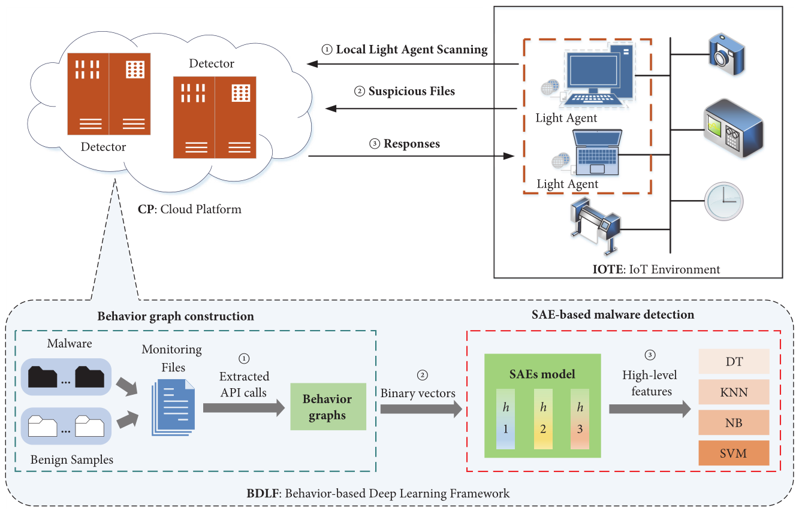

# Malware Detection Based on Deep Learning of Behavior Graphs

物联网 (IoT) 提供了各种好处，使智能设备更加接近。随着物联网中越来越多的智能设备，安全性不再是单一设备的事情。许多针对物联网环境中传统计算机的攻击也可能针对其他物联网设备。在本文中，我们考虑了一种保护物联网设备免受本地计算机攻击的方法。针对这个问题，我们提出了一种新颖的基于行为的深度学习框架（BDLF），它内置在云平台中，用于检测物联网环境中的恶意软件。在提议的 BDLF 中，我们首先构建行为图，以使用提取的 API 调用提供恶意软件行为的有效信息。然后，我们使用**神经网络堆叠自动编码器 (SAE)** 从行为图中提取高级特征。 SAE 的层是一个接一个的插入，最后一层连接到一些添加的分类器。 SAE 的架构为 6,000-2,000-500。实验结果表明，所提出的 BDLF 可以从行为图中学习更高级别的恶意行为的语义，并将平均检测精度进一步提高 1.5%。

## 1. Introduction

每天都会自动生成大量恶意软件变种。赛门铁克最近的报告 [1] 显示，2015 年新的恶意软件比前一年增长了 36%，样本总数超过 4.3 亿。恶意软件的指数增长对我们的日常生活造成了相当大的威胁。

传统计算机在物联网环境中带来了很多攻击。恶意软件攻击计算机并使用受感染的计算机攻击物联网环境中的其他连接设备。例如，Mirai 的变种 Trojan.Mirai.1 可以感染 Windows 主机并利用这些主机感染其他设备。受感染的Windows可以窃取机密信息并将受影响的设备转化为僵尸网络，从而发起新的分布式拒绝服务 (DDoS) 攻击。当前许多传统计算机的恶意软件攻击也可能扩展到其他物联网设备。不幸的是，没有理想的解决方案来避免 Mirai 和其他物联网威胁。一种方法旨在通过保护物联网环境中传统计算机的安全来削弱这些威胁。

快速增长的样本为物联网环境中的恶意软件检测带来了大量需求[2-4]。有了这么多复杂的恶意软件样本，大量的研究都集中在提出各种恶意软件检测方法来缓解恶意软件的快速增长。恶意软件检测可分为两种主要方法：静态恶意软件检测和动态恶意软件检测 [5, 6]。静态恶意软件检测也指基于签名的恶意软件检测，它在不实际执行恶意软件样本的情况下检查恶意二进制文件的内容。基于签名的恶意软件检测能够获得完整的执行路径。但是，它很容易被混淆技术规避。此外，基于签名的恶意软件检测需要事先了解恶意软件样本。

针对基于签名的恶意软件检测的局限性，人们提出了各种动态恶意软件检测方法[7]。动态恶意软件检测分析执行期间的样本行为，通常称为基于行为的恶意软件检测。基于行为的恶意软件检测方法包括虚拟机和函数调用监控、信息流跟踪和动态二进制检测。长期以来，基于 Windows 应用程序编程接口 (API) 调用图的方法一直被认为是基于行为的恶意软件检测的良好前景 [8, 9]。

机器学习算法，如决策树 (DT)、K-最近邻 (KNN)、朴素贝叶斯 (NB) 和支持向量机 (SVM)，通常用于恶意软件检测 [10, 11]。传统的机器学习算法可以潜在地从恶意软件中学习行为特征。不幸的是，大多数机器学习算法的性能取决于提取特征的准确性。此外，通常很难提取有意义的行为特征来提高恶意软件检测性能。此外，特征处理需要专业知识。因此，传统的机器学习算法在恶意软件检测方面仍然有些不尽如人意。

深度学习是机器学习的一个分支，它试图直接从原始数据中学习高级特征。简而言之，深度学习直接提倡端到端的解决方案。它完全消除了大型和具有挑战性的项目阶段的整个过程。深度学习通过多层深度架构有效地研究样本的高级特征，已广泛应用于图像处理、视觉识别、目标检测等[12-17]。

本文介绍了一种保护物联网设备免受本地计算机攻击的方法。在本文中，我们构建了一个基于行为的深度学习框架（BDLF），它充分利用了堆栈自动编码器（SAE）和传统的机器学习算法来检测恶意软件。 SAE 是由多层稀疏自动编码器组成的深度学习模型之一 [18, 19]。我们使用 SAEs 模型从行为图中提取高级特征，然后通过添加的分类器（即 DT、KNN、NB 和 SVM）进行分类。 DT、KNN、NB 和 SVM 与 SAE 模型相结合，分别称为 SAE-DT、SAE-KNN、SAE-NB 和 SAE-SVM。提出的 BDLF 在云平台上实现。

简而言之，主要贡献如下：

1. 在本文中，我们将 SAE 模型与用于恶意软件检测的 API 调用的行为图相结合，构建了一种新的基于行为的深度学习框架，称为 BDLF。提出的 BDLF 旨在在行为图中获得更深层次的语义，而不是以前的 API 调用序列（例如，n-gram）。
2. 在提出的 BDLF 中，我们研究了 SAE 的深度学习模型，以自动获取恶意软件行为的高级表示。我们的实验结果表明，我们的方法可以提取更有意义的抽象特征，并有助于提高恶意软件检测的平均精度。

本文的其余部分安排如下。 第 2 节介绍了相关工作。 第 3 节描述了所提出的基于行为的深度学习框架。 第 4 节介绍了评估和实验结果，第 5 节介绍了结论和未来工作。

## 2. Related Work

随着越来越多的恶意软件攻击和智能设备在物联网环境中的连接，安全不再是一个单独的事件[20-22]。需要检测本地计算机的攻击，以削弱对物联网环境中其他智能设备的威胁。

恶意软件检测被证明是预防物联网威胁的有效方法。贾伟等人提出了一种在物联网环境中检测恶意软件的方法[23]。他们首先将提取的二进制文件转换为图像，然后使用卷积神经网络 (CNN) 来检测恶意软件。实验表明，他们的方法在恶意软件检测中获得了良好的性能。帕等人分析物联网设备并识别物联网环境中的四个恶意软件系列。他们提出了一个物联网蜜罐和沙箱来分析攻击。

恶意软件样本通常通过对操作系统资源执行恶意操作来达到其目的。在[24]中，所提出的行为模型捕获了恶意软件和操作系统资源之间的交互，这些资源包括文件、注册表、进程和网络。桑吉夫等人[25] 观察与文件系统、进程、网络和内存相关的动作。

基于行为的恶意软件检测见证了向 API 调用的转变 [26]。 API 调用模式提供了一个很好的表达方式，有助于“更好地理解恶意软件样本”。 API 调用提供有关恶意软件样本运行时活动的有效信息。吴等人[27] 将 API 调用转换为正则表达式，然后在出现类似的正则表达式时使用这些规则来检测恶意软件。泰金等人[28] 将 API 调用转换为格式化代码，并使用 n-gram 对 API 数据进行分组。普拉蒂克沙等人[29] 通过使用 API 调用及其频率来识别恶意软件。桑吉夫等人[25] 通过使用恶意软件和良性样本的 API 调用和操作系统资源，提出了一种以频率为中心的特征构建模型。

值得注意的是，近年来，深度学习被应用于恶意软件特征提取和检测。文一等人 [30] 提出了一种深度学习架构，其输入依赖于一系列 API 调用事件和空终止对象。博扬等人[31] 使用卷积和循环网络分析恶意软件分类中的 API 调用序列。拉兹万等人[32] 探索了 Echo State Networks (ESNs) 和 Recurrent Neural Networks (RNNs) 的一些变体来预测下一个 API 调用。奥米德 E. 等人[33] 提取 unigrams (1-gram) API 调用，并使用深度信念网络 (DBN) 创建恶意软件行为的不变紧凑表示。伍贤等人[34] 提出了一个深度循环神经网络 (RNN) 来处理 API 调用的序列。威廉等人[12] 使用 SAEs 模型设计深度学习架构。建议的架构基于从可移植可执行文件 (PE) 文件中提取的 API 调用。

以前的工作表明，可以使用不同的策略来构建 API 调用的模式。但是，使用 API 调用的方法及其频率或 API 调用片段是有限的。 Ammar Ahmed E. 等人[35] 证明组合 API 调用及其参数提高了恶意软件检测的准确性，而不是单独考虑 API 调用。在他们的研究中，通过集成 API 调用和操作系统资源，将每个恶意软件表示为 API 调用图。他们首先通过预处理提取 API 调用及其参数，然后使用提出的 API 调用构造算法来构建集成 API 调用图。最后，他们计算不同图之间的相似度来识别输入样本。与之前的工作不同，所提出的 BDLF 是一种使用 API 调用行为图和 SAE 模型的组合方法。我们的方法旨在捕获高级恶意行为，以改进物联网环境中的恶意软件检测。

## 3. Behavior-Based Deep Learning Framework

我们在本节中详细说明了提议的 BDLF。提出的 BDLF 由两个模块组成：行为图构建和基于 SAE 的恶意软件检测。 

### 3.1 System Overview

我们提出的系统概述如图 1 所示。

图1 系统总览

提出的系统由物联网环境 (IoTE) 和云平台 (CP) 模块组成。 IoTE 模块由本地计算机和其他智能设备组成。所提出的 BDLF 在 CP 的检测器中实现，该检测器是行为构建和恶意软件检测的主要模块。**在提议的 BDLF 中，每个程序都由一个行为图表示，该行为图由许多 API 调用图组成。** API 调用图将 API 调用与操作系统资源集成在一起。在构建了行为图之后，CP 将行为特征转换为二进制向量，然后将这些向量用作 SAE 的输入。建议的 SAE 模型中有 3 层。 SAE 的架构是：
$$
h1(6,000)-h2(2,000)-h3(500) \tag{1}
$$
并且最后一个隐藏层的数据用作添加的分类器（即 DT、KNN、NB 和 SVM）的输入）。所提出的 BDLF 的目的是学习高级恶意行为的语义并有效地检测恶意软件。具体来说，每个组件的用途和功能描述如下：

1. IoTE 模块是指物联网环境。本地计算机包含一个已安装的轻型代理，该代理负责收集运行时活动。在该模块中，计算机将新安装的扫描信息或可疑文件传输到 CP 并接收 CP 的响应。
2. CP提供无限的存储空间。 CP 中的检测器负责检测从 IoTE 接收的扫描数据或文件。对于扫描信息，CP 构建行为图，然后将 API 调用图转换为二进制向量，用作 SAE 模型的输入以进行恶意软件检测。对于可疑文件，CP 在 Cuckoo Sandbox 中执行样本，然后从 Sandbox 的监控文件中提取 API 调用。之后，CP 以与扫描信息相同的方式管理监控文件。检测后，CP向IoTE反馈。 

### 3.2 Behavior Graph Construction

基于行为的恶意软件检测中的动作必须只包括安全关键操作和相关的独立操作[36]。我们考虑了对操作系统资源执行的操作，包括服务、进程、文件系统、注册表、同步、网络和系统等七种类型。一个动作包含一组操作，这些操作对应于一组相关的 API 调用 [37-39]。我们在表 1 中列出了操作系统资源类型和一些 API 调用之间的一些关系。表 1 中列出的 API 调用很容易在良性样本中发生。但是，这些 API 调用的组合可能会导致精心设计的恶意目的。我们提出了恶意软件 API 调用的行为图。提议的 API 调用图旨在从 API 调用的组合中学习恶意行为。方框 1 代表恶意软件的代码片段：

1. 创建 nso1.tmp 然后删除（分别在第 (1) 行和第 (2) 行）。
2. 创建 Trojan-Downloader.Win32.Zlob.bcl 并获取其信息；之后，读取并设置Trojan-Downloader.Win32.Zlob.bcl的文件信息（删除、重命名或更改属性，分别在第34568行）
3. 创建 nsi2.tmp（在第 (7) 行）。图 2 表示从框 1 所示的代码片段中提取的三个特征（API 调用图）。我们通过对属于同一操作系统资源类型的相关 API 调用进行分组来构造提取的特征。例如，特征集 AAA 分别在文件资源 nso1.tmp、TrojanDownloader.Win32.Zlob.bcl 和 nsi2.tmp 上执行。

## 4. Evaluation and Experiment Results

## 5. Conclusion and Future Work

