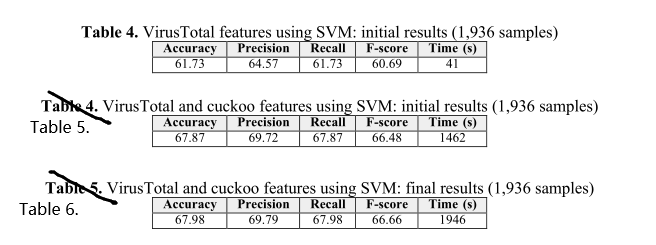

# Using Static and Dynamic Malware features to perform Malware Ascription

恶意软件分类是一个相对未开发的领域，很难确定恶意软件的归属和检测作者身份。 在本文中，我们利用恶意可执行文件的各种静态和动态特征来根据其家族对恶意软件进行分类。 我们利用 Cuckoo Sandbox 和机器学习在这项研究中取得进展。 使用了各种深度学习和机器学习算法进行后期分析和分类。使用从 VirusTotal（静态）和 Cuckoo（动态）报告中收集的特征，我们针对多项朴素贝叶斯、支持向量机和使用决策树作为基本估计器的 Bagging 运行矢量化数据。 对于每个分类器，我们使用详尽的搜索方法调整超参数。 我们的报告在恶意软件归因方面非常有用。

## 1. Introduction

在不久的将来，将是万物互联的时代，这可能会导致私人敏感数据泄露及各种安全威胁、网络犯罪 [1]。 Malware 是恶意软件的缩写，有多种类型，例如病毒、蠕虫、特洛伊木马、勒索软件、间谍软件、rootkit 等等——所有这些都可以针对不同的平台。 众所周知，Windows、Android、OS X、Linux 等操作系统是恶意代码的受害者。 截至 2019 年初，来自分析恶意内容的流行服务 VirusTotal 的每周统计数据表明，大约 33% 的检测到的恶意软件是 Win32 EXE [2]。 仅 Windows 就占据了全球桌面操作系统市场份额的近 75%[3]。 由于 PE 恶意软件的流行，我们选择专注于分析在可执行文件中发现的数据。

防病毒供应商使用多种命名方案来识别文件。 虽然命名格式因供应商而异，但大多数都会包括家族名称。 如 Microsoft 文档 (4) 所述，家族名称是一个标签，用于按共同特征对恶意软件进行分组，包括对同一作者的归属。 出于我们研究的目的，我们将专注于将恶意可执行文件归因于其相应的恶意软件家族，作为真实情况的一个子部分。 为了从我们的样本中提取特征，我们利用了下一节中描述的几种恶意软件分析工具。 这些特征在朴素贝叶斯和支持向量机分类器上进行训练和测试。 在后续实验中，我们将恶意软件转换为灰度和彩色图像，以输入卷积神经网络 (CNN) 进行分类。 在我们的实验中，我们只获得这些图像的一个子样本的结果，其余的留作未来的实验。

## 2. Previous Work

一些团队 (5)、(6)、(7) 进行了调查，详细说明了恶意软件分析中使用的方法。 报告详细介绍了许多对恶意软件分类或归因有用的功能。 根据执行的分析类型，将提供不同的功能。

### 静态分析

在静态分析中，无需执行代码本身即可收集恶意软件特征。 对于 Windows 原生的可移植可执行 (PE) 文件，分析师通常使用可以显示 PE 标头信息的表格视图、反汇编机器语言、提取可打印字符串、确定文件哈希等的工具。 静态分析包括文件散列、字符串、操作代码序列、DLL 导入、API 调用和 PE 标头中的其他元数据 (6)。 在恶意软件可视化中，研究人员建议以二进制、十进制或十六进制等原始数字形式查看软件内容，并将这些数字字符串转换为图像 (8)。

### 动态分析

与静态分析相反，动态分析涉及恶意代码的执行。 虽然这比静态分析更难扩展，但监控二进制文件如何与受感染系统交互可以带来更多洞见。 分析师通常对记录 API 和系统调用、进程、对系统文件和注册表的修改、网络通信等感兴趣。 (5), (9)。

### 混合分析

静态和动态分析在单独进行时都有其自身的局限性。 例如，压缩软件的打包程序可以用作混淆工具来混淆可执行文件的内容。 这通常需要恶意软件分析师的手动工作来对机器代码进行进一步的静态分析。 动态分析并不总是成功，因为某些类型的恶意软件需要一定的持续时间才能通过或需要特定事件来触发其执行。 混合分析是静态和动态分析的结合，可以提供更全面的恶意程序视图，并使研究人员能够收集更大的特征集进行分类 (6)。

## 3. Analysis for Malware Classification

安全形势在不断变化。 随着研究人员开发新技术来防御敌对威胁，攻击者正在调整他们的行为以逃避检测 (10)。 在本文中，我们对有助于分类最新恶意软件威胁的特征感兴趣。 因此，我们将分析 2018 年 2 月至 2019 年 2 月期间从名为 Virus Share (11) 的恶意软件存储库收集的样本。 特征集合涉及一种混合方法，其中静态特征将来自名为 Virus Total (2) 的免费恶意软件扫描服务生成的报告。 我们的 PE 文件的二进制内容将进一步转换为图像，为归属创建额外的特征空间。 最后，我们的恶意软件的子样本将在名为 Cuckoo (12) 的开源恶意软件分析系统中进行动态分析，其中将收集动态特征。

### Virus Share

我们的可执行文件数据集是从 Virus Share 收集的，Virus Share 是一个在线存储库，可供安全研究人员和专业人员访问恶意代码样本 (11)。 从 2018 年 2 月开始到 2019 年 2 月结束，包含该项目中涉及的恶意软件的文件夹被上传到 Virus Share 存储库。文件夹的内容被过滤为 PE 文件，所有非 Windows 恶意软件都被丢弃。 这给我们留下了大约 120,000 个样本。

### Virus Total

我们的 120,000 个恶意样本中的每一个都通过 Virus Total 进行扫描，为每个样本生成一个 JSON 报告。 从我们收集的 JSON 报告中，我们为我们的实验收集了一组静态特征。 除了提供静态功能外，Virus Total 还会显示在撰写本文时使用的 69 个 Anti Virus 扫描程序中的每一个生成的恶意软件标签。

### AVClass

恶意软件标签提供的格式和信息量因扫描仪而异。 例如，Microsoft 的恶意软件标记约定以后缀 (4) 的形式提供类型、目标平台、系列名称、变体和额外详细信息。 AVClass 利用 VirusTotal 使用的整个防病毒扫描程序集合提供的标签，并基于多数票输出最可能的Family Name。 可以在随附的论文 (13) 中找到有关 AVClass 的更多详细信息。 当我们测试静态特征时，我们会删减包含少于 20 个样本的族。 这给我们留下了大约 95,000 个样本和 248 个家族。

### Cuckoo Sandbox

我们使用分层随机抽样来选择将在 Cuckoo Sandbox 中进行自动动态分析的可执行文件。 从属于 248 个病毒家族的 120,000 个样本的初始数据集，我们只考虑至少有 50 个样本的家庭，剩下 124 个家庭。 从这些家族中的每一个中，我们随机抽取了 20 个恶意可执行文件以供 Cuckoo 分析。 这给了我们 20 * 124 = 2,480 个样本。 每个样本分析两分钟，并生成 JSON 格式的行为报告。 出于本实验的目的，我们不对系统执行内存分析。

### Visualization

应用类似的可视化采样策略，我们从 124 个家族中的每个家族中随机抽取 50 个恶意可执行文件，每个家族至少包含 50 个样本。 这给了我们 50 * 124 = 6,200 个我们将考虑用于可视化实验的恶意二进制文件。 我们以无符号十进制表示法转储每个恶意软件样本的原始字节。 然后我们将每个十进制字节从值 0-255 映射到具有不同强度的灰度像素。 黑色将由值 0 表示，而白色将由 255 表示。 每个样本生成一个图像，其宽度取决于可执行文件的大小。 下面提供了一个参考表。 

这种方法已在之前的实验中使用，例如（8）和 [viv]。 为了用适当数量的像素填充图像的尺寸，一些二进制文件要求我们用字节值“000”填充末尾。 我们的一些结果样本及其相应的系列标签如图 2 所示。

还使用相同的原始字节生成单独的彩色图像。 我们建议使用三个字节（tri-grams）的滑动窗口，而不是将一个字节值映射到一个像素。 我们使用的步长是 1，在这种情况下，我们将生成的图像称为重叠彩色图像，在这种情况下，我们将生成的图像称为非重叠彩色图像。 每个字节将代表红色、绿色或蓝色像素的值。 例如，考虑以下以 10 进制或十进制表示法的六个字节序列：
$$
077\ 090\ 144\ 000\ 003\ 000
$$
从这个序列中，我们的重叠窗口将生成四个像素值：(R: 077, G: 090, B: 144), (R: 090, G: 144, B: 000), (R: 144, G: 000 , B: 003) 和 (R: 000, G: 003, B: 000)。 我们的非重叠窗口将简单地生成两个像素值：(R: 077, G: 090, B: 144) 和 (R: 000, G: 003, B: 000)

## 4. Methodology

每个 VirusTotal 扫描提供的功能因样本而异。 从 Cuckoo Sandbox 生成的报告中也可以观察到同样的情况。 出于这个原因，我们决定收集 VirusTotal 报告和 Cuckoo 报告的特征计数。 然后，我们确定了在我们的大约 96,000 个样本集中出现频率最高的特征。 根据特征描述和以前的工作，我们认为 13 个重复出现的特征值得研究。

### VirusTotal Features

- TRID：由二进制签名得到文件类型标识
- PE_RESOURCE_LIST：PE文件的资源结构
- EMBEDDED_DOMAINS_LIST：嵌入在可执行文件中的域名
- IMPORTS_LIST：导入的 DLL 和使用的函数调用
- CONTACTED_URLS_LIST：链接的外部 URL

### Cuckoo Features

- SIGNATURE：额外的行为上下文
- BEHAVIOR_CALLS：运行的可执行文件和使用的 API 调用
- BEHAVIOR_DLL_LOADED：被加载的 DLL
- NETWORK_HTTP：发出的 HTTP 请求
- NETWORK HOSTS：相关的 IP 地址
- STRINGS：可打印字符
- NETWORK_UDP_SRC：UDP 通信的源 IP/端口
- NETWORK_UDP_DST：UDP 通信的目的IP/端口

### Feature Extraction

解析 JSON 报告，并使用以下方法提取特征：

- TRID：我们只从 TrID 中获取最可能的文件类型并将其用作特征。
- PE_RESOURCE_LIST：我们使用分号 (resource_hash:data_type) 组合每个资源哈希及其数据类型

- EMBEDDED_DOMAINSLIST：我们提取每个嵌入的 URL。 仅提取基本 URL，并从 URL 中删除 [http://、https://、www.] 的实例。
- IMPORTS_LIST：我们使用分号（import_name:method）将每个DLL 与其每个函数调用组合在一起。
- CONTACTED_URLS_LIST：我们提取每个联系的 URL。 仅提取基本 URL，并从 URL 中删除 [http://、https://、www.]。
- 签名：我们从报告中提取每个签名。
- BEHAVIOR_CALLS：我们提取可执行文件在会话中运行的每个API 调用。
- BEHAVIOR_DLL_LOADED：我们提取可执行文件加载的每个DLL。
- NETWORK_HTTP：我们提取每个 HTTP 请求。
- NETWORK_HOSTS：我们提取每个 HOST 请求。
- 字符串：我们提取每个字符串。 从每个字符串中删除所有空格。
- NETWORK_UDP_SRC：我们使用分号 (IP:port) 将每个 IP 与其端口组合在一起。
- NETWORK_UDP_DST：我们使用分号 (IP:port) 将每个 IP 与其端口组合在一起。

并非每个恶意软件报告都有以上所有特征。 在特征提取过程中，如果特征不存在，那么在大多数情况下我们会简单地跳过该特征。 在某些情况下，我们将完全跳过该特定恶意软件样本。

### Vectorization

每个特征使用的向量化类型是根据初步测试确定的。 我们选择了最适合该功能并提供尽可能高准确度的类型。 以下是用于每个特征的矢量化：

- TRID: One-hot-encoded
- PE RESOURCE_LIST: 1, 2, 3 Grams
- EMBEDDED_DOMAINS_LIST: 1 Gram
- IMPORTS_LIST: 1, 2, 3 Grams
- CONTACTED_URLS_LIST: 1, 2, 3 Grams
- SIGNATURES: 1, 2, 3 Grams 
- BEHAVIOR_CALLS: 3 Grams 
- BEHAVIOR_DLL_LOADED: 1, 2, 3 Grams
- NETWORK_HTTP: 1, 2, 3 Grams 
- NETWORK_HOSTS: 1, 2, 3 Grams
- STRINGS: 1, 2, 3 Grams. 
- NETWORK_UDP_SRC: 3 Gram
- NETWORK_UDP_DST: 3 Gram

提取所有特征后，我们采用卡方检验对每个特征进行排名。 然后我们选择排名前 50% 的特征作为我们的分类特征。

### Feature Contribution Experiments

我们将两组特征用于两个不同的实验。在第一个实验中，我们只考虑 VirusTotal 特征。在第二个实验中，我们考虑了 VirusTotal 和 Cuckoo 特征的组合。使用类似于（15）中使用的方法，我们对每个静态和动态特征进行实证测试，以了解它们如何对分类结果做出贡献。对于每个特征，我们选择一个省略，同时将其余特征用作以下分类器的输入：(1) 多项朴素贝叶斯，(2) 支持向量机，以及 (3) 使用决策树作为基础估计器的 Bagging。我们测量准确度、召回率、精确度、F 分数和执行时间。我们的实验结果显示在第 V 部分的 C 和 D 小节下。具有 NETWORK UDP SRC 和 NETWORK UDP DST 功能的初步测试证明它们是无用的且非常有害。因此，他们不再进行任何进一步的测试。执行时间在不同的leave-out间有着较大波动，这是由处理的特性所决定的。因此，我们在评估特征贡献时不考虑时间。

### Classifiers

使用从 VirusTotal（静态）和 Cuckoo（动态）报告中收集的特征，我们针对三个不同的分类器运行矢量化数据：(1) 多项朴素贝叶斯，(2) 支持向量机，以及 (3) 使用决策树作为 基估计量。 对于每个分类器，我们使用详尽的搜索方法调整超参数。

对于 SVM，我们使用了线性核函数，它产生了最一致和最好的结果。 我们尝试使用的其他核函数是：rbf、poly 和 sigmoid。 对于 Bagging，发现具有合理执行时间的最佳结果的超参数为：n 估计量 = 1000，最大特征 = 0.1，最大样本 = 0.1。 我们发现 SVM 比朴素贝叶斯和 Bagging 产生了最好的结果。 因此，我们仅使用 SVM 显示我们的最终结果。

### Visualization

对于我们的可视化实验，在将它们传递到我们的 CNN 之前，有必要调整具有标准化尺寸的图像的大小。 我们的样本大小为 $n = 6200 $个采样二进制文件。 让$m_k$表示与单个恶意软件样本对应的一组图像。 然后我们的整个图像集集合表示为：
$$
M={m_1, m_2, \dots, m_n}
$$
对于每个恶意软件的图像集合$m\sub M$，生成了9张对应的归一化图像，即
$$
m_k=\{g_c, g_m, g_e, o_c, o_m, o_e, n_c, n_m, n_e\}
$$
其中$g$表示灰度图，$o$表示重叠彩色图(Overlapping coloured)，$n$表示无重叠彩色图(Non-Overlapping coloured)；$c$表示压缩质量，$m$表示中值图像，$e$表示伸拉图像。

为了导出压缩图像尺寸，我们从一组灰度、非重叠彩色或重叠彩色图像中取像素尺寸平方根的最小值。 然后我们对结果应用向下取整函数。 这为我们提供了归一化压缩图像两侧的尺寸。 让$I_g$表示一组灰度图像维度，而$i$是该集合中的任意一对灰度图像维度。 然后，对于集合$I_g$中的所有图像，压缩高度$h_c$和压缩宽度$w_c$导出如下：
$$
h_c=w_c=\min_{i\in I_g}(\sqrt{i})
$$
对于重叠和非重叠彩色图像也使用相同的方式压缩图像。

为了导出中值图像尺寸，我们从一组灰度、非重叠彩色或重叠彩色图像中取中值尺寸的平方根，并对结果应用向下取整函数。 这为我们提供了归一化中值图像两侧的尺寸。 集合$I_g$中所有图像的中值高度 $h_m$和中值宽度$w_m$推导如下：
$$
h_m=w_m=\sqrt{m}
$$
对于重叠和非重叠彩色图像也使用相同的方式获取中值图像。

为了导出拉伸图像尺寸，我们从一组灰度、非重叠彩色或重叠彩色图像中取像素尺寸平方根的最大值。 然后我们对结果应用了向上取整函数。 这为我们提供了标准化扩展图像两侧的尺寸。 对于集合$ I_g $中的所有图像，扩展高度 $h_e$ 和扩展宽度$w_e$的导出如下：
$$
h_c=w_c=\max_{i\in I_g}(\sqrt{i})
$$
对于重叠和非重叠彩色图像也使用相同的方式获取拉伸图像。

归一化我们的图像尺寸集的结果显示在表2中。 使用 Keras (16) 和前面部分中导出的维度，我们使用最近邻插值来调整内存中原始图像的大小。 我们的图像生成器随机采样、混洗和增强图像以扩展初始训练集。 然后将这些图像输入到具有多类输出的 2D 卷积神经网络中，其中输出节点表示样本属于 124 个恶意软件家族中的一个的概率。 我们对损失函数使用分类交叉熵，并记录结果以确保准确性。 结果列在第五节 E 小节下。

## 5. Results

### 实验环境

以下是用于产生表 III、IV、V、VI、VII 和 VIII 中结果的机器规格：

- Intel(R) Core(TM) i7-7700K CPU @ 4.20 GHz
- 16 GB RAM

### 评价指标

$$
Overall Accuracy = \frac{TP+TN}{TP+TN+FP+FN}=\frac{TP+TN}{P+N} \\
Precision = \frac{TP}{TP+FP}\\
Recall = \frac{TP}{TP+FN}\\
F1\_Score = \frac{2\times Precision\times Recall}{Precision + Recall}
$$

### VirusTotal Feature Contributions

我们对静态特征的调查涉及来自总共 248 个恶意软件家族的大约 95,000 个样本。 将所有 VirusTotal 特征用于 SVM 的结果显示在表3中。 我们使用留一法选择了一个静态特征，并使用其余特征作为输入重新运行我们的 SVM，对五个特征中的每一个都重复这个实验。 结果如表7所示。 没有一个静态特征被确定为无用，因此所有五个特征都用于最终分类器。 因此，我们的最终结果保持不变，除了时间的变化可以忽略不计。 使用所有静态特征，最终准确率显示为约 85%。

### Cuckoo Feature Contributions

对于我们对动态特征的调查，并非所有恶意软件样本都包含所有八个感兴趣的特征。从我们的 2,480 份 Cuckoo 报告中，我们选择包括来自所有恶意软件系列的报告，其中至少包含 18 个样本。这给我们留下了来自 101 个恶意软件家族的 1,936 个样本。我们的初始结果，仅考虑我们 SVM 中的静态 VirusTotal 特征，如表 IV 所示。将所有 Cuckoo 特征与 SVM 的 VirusTotal 特征相结合的结果如表 V 所示。两个表之间的差异显示了混合分析（结合静态和动态特征）如何提高恶意软件家族分类的准确性。就像我们之前在 95,000 个样本数据集上的实验一样，我们使用留一法选择了一个动态特征来省略并使用其余特征作为输入重新运行我们的 SVM。我们对八个动态特征中的每一个都重复了这个实验。该实验的结果如表 8 所示。NETWORK HTTP 和 NETWORK HOSTS 被确定为无用。通过删除这两个特征，我们的最终准确率提高了 0.11% 至 67.87%。最终结果如表 6 所示。

### Classifying Malware Images

对于可视化实验中涉及的 6,200 个恶意软件样本中的每一个，我们生成了九个相关的标准化图像——其中三个是灰度图像，其中六个是彩色图像。 由于时间限制，我们使用 2D CNN 的分类结果仅限于压缩的灰度图像。 对于压缩的灰度图像，准确率为 97%，证明恶意软件可视化的特征可用于分类。

## 6. Conclusion

在本文中，我们对 VirusTotal 报告、Cuckoo Sandbox 分析和二进制可视化生成的恶意软件特征进行了混合分析。我们的性能指标评估了这些功能如何训练我们的分类器将恶意二进制文件归因于恶意软件家族。使用具有由 Virus-Total 和 Cuckoo 生成的特征的支持向量机得到了最好的结果，与使用决策树的朴素贝叶斯和 Bagging 相比，证明具有更高的性能。此外，还进行了实验以评估每个静态和动态特征的归因效果。所有静态功能都被证明是有用的，只有少数动态功能对我们的性能指标有不利影响。最后，我们使用 2D 卷积神经网络执行恶意软件图像分类。我们的模型能够基于压缩的灰度图像对恶意软件进行高精度分类，确认恶意软件图像中的特征可用于分类。

## 7. Future Work

尽管过去在对恶意软件的各种特征进行聚类方面已经做了一些工作，例如在 Cuckoo 报告中发现的那些，[17]，[18]，但我们相信未来在无监督的恶意软件图像聚类方面还有工作空间。 许多探索恶意软件可视化的论文都专注于分类任务。 但是，对于未标记的数据集，可以从 CNN 中提取特征，并将其用作各种聚类算法的输入。 分析集群恶意软件之间的相似性可能会提供有用的好处，例如签名生成或更好地了解恶意软件所属家族 [18]。